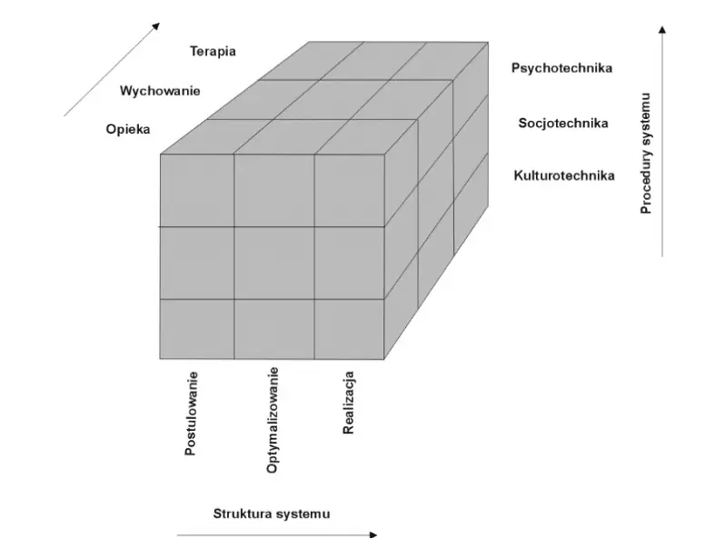
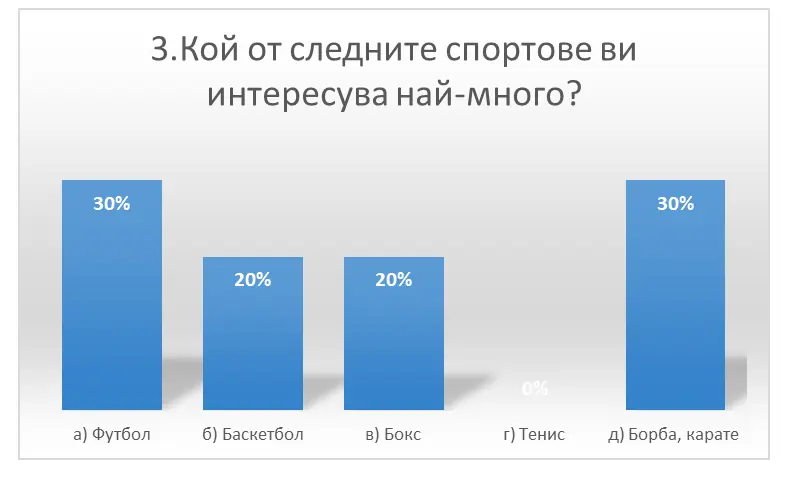
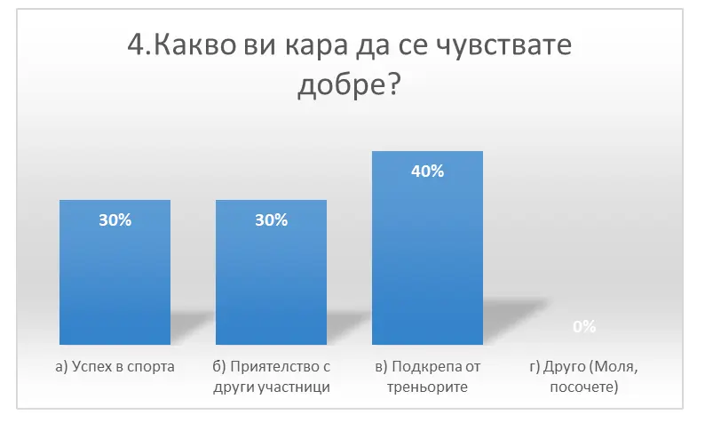
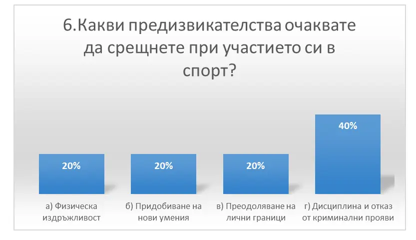
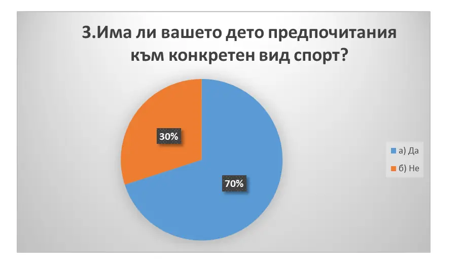
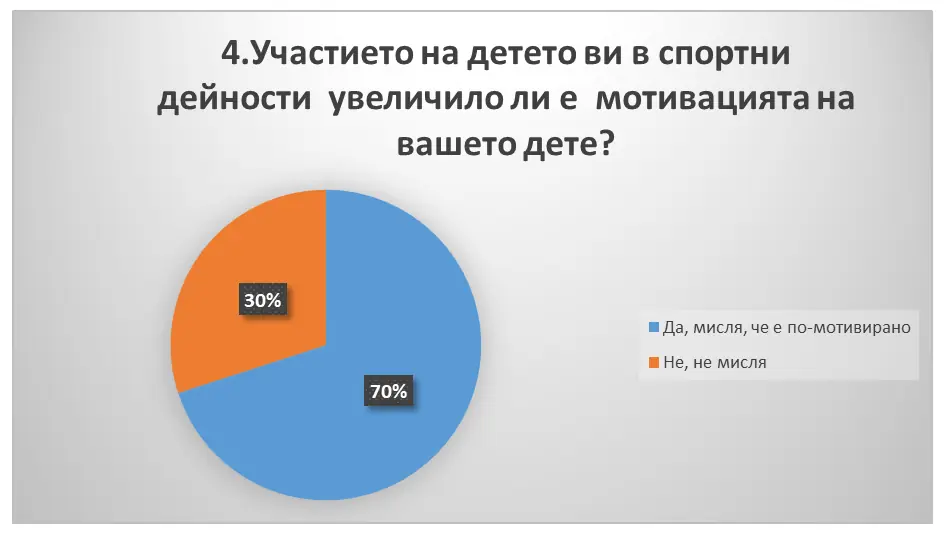
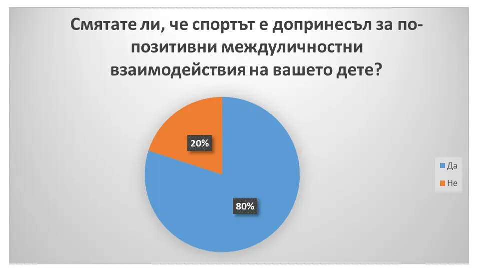
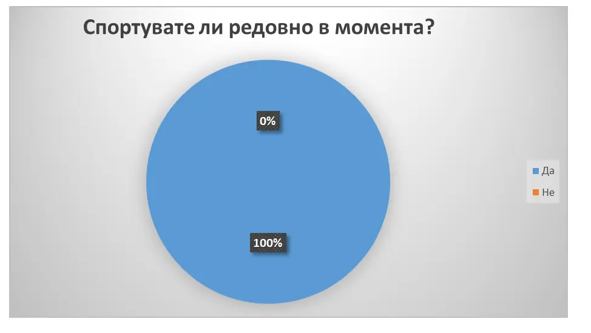
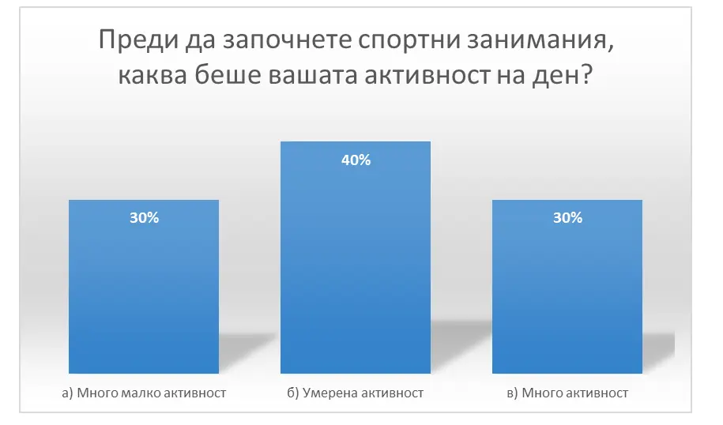
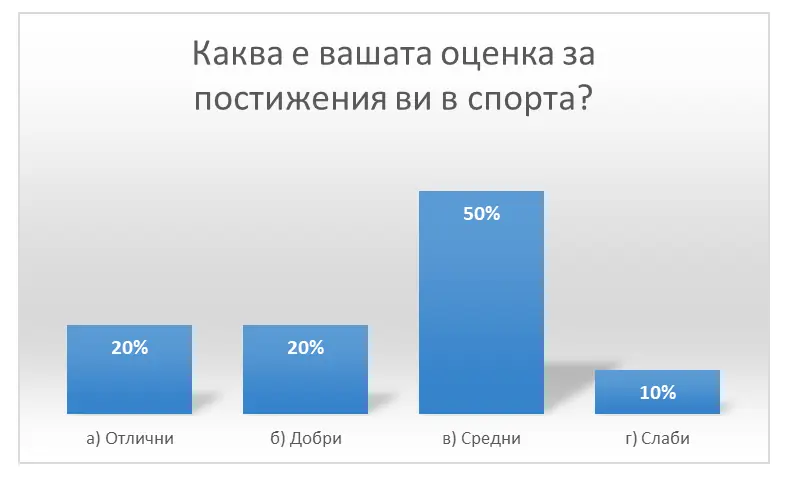

ДИСЕРТАЦИЯ

ТЕМА: ВЪЗПИТАНИЕ НА ДЕЦАТА ОТ КРИМИНАЛНИЯ КОНТИНГЕНТ (ВЪЗМОЖНИ МАЛЦИНСТВА) ЧРЕЗ СПОРТ

СЪДЪРЖАНИЕ

СПИСЪК НА ИЗПОЛЗВАНИ СЪКРАЩЕНИЯ

ЕС – Европейски съюз

ФВ – Физическо възпитание

СЗО – Световна здравна организация

УВОД

Предотвратяването на престъпността не е основната цел на спорта и физическата активност, но може да бъде изключително положителен за това. Могат ли спортът и физическата активност да се използват като стратегии за превенция на престъпността?

Доказателствата са окуражаващи; предполага, че при внимателно планиране спортът и физическата активност имат потенциал за превенция на престъпността. Младите хора могат лично да се възползват от тези програми. Спортът, разгледан като инструмент очертава някои процеси, чрез които това може да се случи, и прави следните изводи:

Спортът и физическата активност могат да се комбинират с други интервенции за намаляване на престъпността в определени групи и общности.

Спортът и физическата активност могат да намалят престъпността чрез предоставяне на достъпни, подходящи дейности в подкрепящ социален контекст. С други думи, спортът и физическата активност трябва да бъдат положително свързани в рамките на социалната тъкан на групи и общности.

Интервенциите, базирани на спорт и физическа активност, трябва да се провеждат в сътрудничество с набор от други стратегии и сектори.

Елитни спортни организации могат да участват в програми, насочени пряко към определени престъпления или общности.

От съществено значение е да се обмисли как дизайнът, местоположението и финансирането на инфраструктурата за спорт и отдих допринася за социалното сближаване и избягва изваждането на спорта и физическата активност от социален контекст.

Случаите не предполагат стратегии „един размер за всички“; вместо това те представляват стойността на подходите за развитие на общността за адаптиране на програми към конкретни нужди. Въпреки това, това не трябва да ни пречи да предлагаме общи стратегии и процеси и да събираме примери за добри практики.

Програмите за отдих и спорт, създадени с изричната цел за предотвратяване на престъпността, трябва да бъдат обект на стриктна оценка.

Не всички спортове са подходящи за много уязвими и изложени на риск млади хора и има ясна необходимост от възприемане на подход, основан на нуждите, а не на продуктов (Coalter et al, 2000). Има някои доказателства за необходимостта от малки групи или индивидуални дейности, които са несъстезателни, наблягат на лично изградени цели и имат минимум официални правила и разпоредби.

Sugden и Yiannakis (1982) предполагат, че някои юноши отхвърлят организирания, състезателен масов спорт, защото съдържа елементи, подобни на тези, които те вече не са успели да разрешат - придържане към официални правила и разпоредби, постигане на външно дефинирани цели и състезателни и тестови ситуации.

Serok (1975) предполага, че престъпниците предпочитат игри с по-малко и по-малко определени правила и с по-малко изисквания за съответствие. Робинс (1990) се позовава на редица отвличащи спортни проекти, чиито основни характеристики са отворен достъп и липса на строга организация.

Признаването на тези проблеми е в основата на програми, които използват спорта за рехабилитация на нарушителите и намаляване на рецидивизма. Такива програми често използват приключенски дейности на открито или „взискателни програми за физическа активност“, насочени към развиване на лични и социални умения и подобряване на самочувствието и собствената ефективност.

Въпреки че доказателствата за успеха на такива програми са променливи (Taylor et al, 1999), се твърди, че в сравнение с разходите за наказателно преследване и задържане, такива програми са „добро съотношение цена/качество“ (Tsuchiya, 1996). През 1994 г. Купърс и Либранд изчисляват, че „ползата за обществото от предотвратяването на едно младежко престъпление би била спестяване на разходи, еквивалентни на най-малко 2300 лири, малко под половината от които биха могли да бъдат възстановени директно от публичната чанта“.

Актуалността на избраната от мен тема се обуславя от факта, че все още няма задълбочени изследвания как и дали спорта оказва положително  влияние върху криминално проявени лица.

Обект на изследване са деца с криминални и девиатни прояви.  Предмет на изследване е влиянието на спорта и спортните дейности при деца с криминални прояви и въздействието върху тяхното възпитание.

Цел на дисертацията се явява анализ и разработване на методика включваща спорт и спортни прояви при деца с криминални прояви.

Задачите, които следва да се поставят и решат са следните:

Да се направи теоретичен обзор на проблема, като се разгледат и анализират различните системи за ресоциализация на деца от криминалния контингент;

Да се разработи методика чрез спортни дейности, която да е насочена към превенция на криминални прояви;

Да се анализира и отчете практически влиянието на тази методика.

ОЩЕ

Хипотези:

Хипотеза 1: Участие в спортни програми повишава социалната адаптация на деца, склонни към престъпления, като утвърждава позитивни междуличностни връзки и подобрява комуникационните умения.

Хипотеза 2: Спортът допринася за развиване на самодисциплина и самоорганизация при децата, които са били включени в престъпна дейност, като ги насочва към целенасочени и позитивни дейности.

Хипотеза 3: Спортните програми предоставят структурирана и позитивна среда, която отвлича децата от негативните влияния и рискови обстановки, които могат да насърчат престъпна поведение.

Хипотеза 4: Участието в спорт укрепва самочувствието и самоуважението на децата, които са изпитвали отчуждение и ниското им самовъзприятие може да бъде причина за престъпно поведение.

Хипотеза 5: Спортът предоставя път за канализиране на агресия и негативни емоции, които могат да са фактори за включването на деца в престъпни активности.

Хипотеза 6: Участие в спортни програми повишава нивото на физическа активност и здравословния начин на живот, което може да намали вероятността от употреба на наркотици и алкохол, свързани с престъпността.

Методология – използвани са индуктивни и дедуктивни методи.

ГЛАВА ПЪРВА.

СЪСТОЯНИЕ НА ПРОБЛЕМА. ЛИТЕРАТУРЕН ОБЗОР

1.1 Криминалната субкултура като фактор на въздействие на личността и поведението на подрастващите с девиантно поведение

Престъпната субкултура е мощен фактор, влияещ върху личността и поведението на подрастващите. Възниквайки, престъпната субкултура нахлува в официалната култура, деформирайки я. Тази субкултура е привлекателна за юноши с девиантно поведение и чрез излъчване на практически утвърдени примери за престъпно поведение чрез медиите (филми, телевизионни предавания и др.) значително засилва това влияние (често сюжетната линия на филма е структурирана така, че зрителят симпатизира на отрицателния герой).

Според В. Пирожков престъпната субкултура се разбира като съвкупност от духовни и материални ценности, които регулират и рационализират живота и престъпната дейност на престъпните общности, което допринася за тяхната жизненост, сплотеност, активност и лабилност и приемственост на поколенията. Основата на престъпната субкултура се състои от ценности, норми, традиции, различни ритуали и стилове на комуникация, които са чужди на гражданското общество (Пирожков, 1995).

По този начин престъпната субкултура допринася за развитието на престъпни групи. Социалната вредност на това явление се състои в това, че социализацията на индивида протича в уродлива форма, стимулирайки го (личността) към противоправни действия и служейки като механизъм за „възпроизвеждане” на престъпността сред подрастващите, провокирайки отклонения в характеристиките на комуникацията, специфичното възприемане на себе си, другите хора и света като цяло.

Основните характеристики на престъпната субкултура на подрастващите с девиантно и делинквентно поведение са следните: липса на чувство за състрадание към хората, включително „своите“; нарушаване на правата на личността, изразяващо се в агресивно, жестоко и цинично отношение към „непознати”, слаби и беззащитни; нечестност, двуличие, по отношение на „нас“ и „непознати“; паразитизъм, подигравка, обезценяване на човешкия труд и човешки живот, насърчаване на долни инстинкти и всякакви форми на противообществено поведение (Баева, 2010).

Въпреки това, степента на формиране на престъпната субкултура, нейното влияние върху индивида и групата варира. Среща се под формата на отделни, несвързани елементи; може да получи определен външен дизайн чрез „закони“, които играят важна роля в регулирането на поведението на индивид и група; тя е в състояние да доминира в институция (квартал, селище), напълно подчинявайки както престъпния контингент, така и спазващите закона тийнейджъри.

Можем да дадем примери за степента на формиране и ефективност на престъпната субкултура сред тийнейджърите  (Табайков, 2001):

признаци, характеризиращи отношението към нормите и ценностите на културата, приети в обществото: избягване, отказ от спазване на нормите и правилата на поведение; демонстриране на „вашите“ норми на поведение, свързани с отклонение (пушене и пиене на алкохол на обществени места, нецензурен език, битки и др.); активно проявление на негативно отношение (до открита конфронтация) към тези, които се съобразяват със социалните норми и правила; преминаване през обред на посвещаване в училищна среда (тестване за „истинско дете“), придружен от побой и унижение от връстници (Интернет е пълен с видеоклипове за подобно поведение сред тийнейджъри).

признаци, характеризиращи междугруповите отношения и груповата йерархия: наличието в образователна институция на воюващи групи и конфликти между тях; разделяне на хората на „ние” и „непознати”, а „ние” на касти; наличието на различни привилегии за „елита“; преобладаване на ритуали, „регистрация” на новодошлите;

признаци, характеризиращи отношението към слабите, „по-ниските класове“ и „изгнаниците“: фактът на появата на „изгнаници“ („недосегаеми“); брандиране на вещи и предмети, които трябва да се използват само от „недосегаеми“; излагане на „изгнаника” на изнудване и изнудване; разпространението на специални методи за понижаване на социалния статус; разпространението на фалшиви заболявания и самонараняване сред „по-ниските класи“.

Изследванията потвърждават, че разделението на слоеве и касти е институционален елемент на културата в затворническото пространство.

Подобен е характерът на отношенията между учениците в училищата и средните специализирани образователни институции; в резултат на задълбочени интервюта тийнейджърите идентифицират такива категории връстници като: „дяволи“, „гъзарите“ и др.

признаци, характеризиращи използването на свободното време: разпространение на хазартни игри; разпространението на свободното време на затворниците; писане на затворнически текстове и затворнически занаяти; групова употреба на токсични и наркотични вещества;

признаци, характеризиращи методите на комуникация, идентификация и комуникация: наличието на прякори като средство за стигматизация; разпространението на татуировките като символична система за комуникация, идентифициране на „приятели“ и стигматизиране; разпространение на криминален жаргон и други методи за комуникация, приети в престъпната среда.

Тези критерии са външни признаци на деформация на личността. Важно място в престъпната субкултура заемат „митовете“ (криминална митология), които внушават сред тийнейджърите образите на „успешен крадец“, „смел разбойник“, култивиращи „крадската романтика“, идеята за „крадци „братство”, „крадска чест” и активно въздействащи върху мирогледа.

Традициите действат като механизъм за приемственост и стабилност на отношенията, които са се развили в престъпната субкултура, поддържайки девиантно деструктивно, както и престъпно поведение на участниците. Както и в обикновените социални общности, престъпните традиции са продукт на социално взаимодействие и фактор, регулиращ тяхното поведение и междугрупови отношения, предавани един на друг. Най-често нормите на престъпната субкултура приемат формата на традиции. В същото време традициите, които са се развили в престъпните групи, се отличават, от една страна, с тяхната универсалност, а от друга, с известна оригиналност (Баева, 2010).

Острацизмът, който съществува от древни времена (изгонване на хора от племена, общество, държава, от работа), е особено разпространен в престъпната субкултура. Методите за остракизъм са добре известни: първо, дискредитирайте индивида, обезличавайте го и след това изисквайте той да бъде отстранен от екипа. Остракизмът има „нормативна” основа и ясна процедура за изпълнение. Неговата опасност се крие във факта, че той става все по-широко разпространен сред подрастващите и младите хора, прониквайки в структурата на общуването на поведенческо ниво (Табайков, 2001).

Отново чрез медиите тийнейджърите са добре информирани за методите за деперсонализация, използвани в криминалната среда, за процедурите и механизмите на остракизъм. Престъпният свят също има „свой“ език - криминален жаргон (феня).

Функциите му са да разрешава комуникативни ситуации, свързани с престъпна дейност. Криминалният жаргон на тийнейджърите има своята специфика. Поради особеностите на възрастта си, те активно трансформират своя речников запас, по-лесно го усвояват и използват по-интензивно. Оттук и по-силното въздействие върху променящите се интелектуални структури. Криминалният жаргон осигурява приемствеността на законите, традициите и „духовния“ живот на престъпния свят.

Проникването на неговите елементи в ежедневието е изключително опасно, тъй като засяга промяна в стила на общуване и поведение към девиантност и като следствие престъпност. В същото време тийнейджърите активно въвеждат затворническия жаргон в живота си, тъй като съвременният свят на възрастните е показателен за тях.

Друго важно проявление на затворническата култура е широкото разпространение в културата на шансона или криминалната песен - музикален жанр, първоначално предназначен за средата на затворници и хора, близки до престъпния свят.

Престъпната субкултура по своята същност е агресивна. Тя нахлува в официалната култура, обезценява нейните норми, налага свои собствени правила, ценности и атрибути. Криминалната субкултура е истински феномен. Неговите норми и ценности са важни фактори, допринасящи за развитието на престъпен стил на поведение сред подрастващите. Намаляването на социалната и психологическата вреда от такова излагане е една от задачите на такива социални институции като образованието и семейството (Табайков, 2001).

1.2 Ефектите и приложението на спорта при ресоциализиция на криминално проявени лица /непълнолетни деца/

Спортът и физическата активност играят важна роля в съвременното общество. Наистина спортът и физическата активност имат голямо значение за много хора. Групи от хора се събират около екипни дейности като нетбол, футбол и ръгби. Някои дейности са по-индивидуализирани, като сърфиране, каране на скейтборд и балет. Участниците може да изпитат награди от напрегната дейност, но може да има и други награди.

Спортът и физическата активност имат потенциала да подобрят качеството на живот. През 19 век Томас Арнолд превръща спорта в централна част от образователната програма за момчета в Англия, с надеждата, че може да бъде предадено морално възпитание и като форма на „изграждане на характера“.

По това време жените също настояват за същите образователни и спортни възможности като мъжете. В края на 19 век и началото на ХХ век едно движение развива професионално обучение за жени по гимнастика, като се има предвид неговата лечебна, образователна и естетическа стойност (Fletcher, 1984).

Идеята, че спортът е морално възпитание, е дискредитирана. Въпреки това си струва да се проучи идеята, че спортът и физическата активност са важни, ако младите хора искат да участват пълноценно в обществото. В годината, когато Австралия е домакин на Олимпийските игри, има достатъчно доказателства за финансовите възнаграждения, които текат към елитните спортисти.

За много обикновени хора спортът и физическата активност са просто забавление или фантазия, която позволява на човек да избяга от ежедневната реалност на семейни конфликти, бездомност или изкушенията да употребява алкохол, наркотици или да вдишва бензин.

Днес спортът не е само форма на физическа активност и мярка за взаимодействие, използвана в училища, младежки клубове, детски градини и дневни центрове. Спортът все по-често се използва в процеса на ресоциализация.

Ресоциализацията според Калиновски (2008) е„… разновидност на образователния процес, който превръща индивид, който не е адаптиран към изискванията на социалния живот, в ресоциализиран индивид, т.е. социализиран, независим и креативен“. (P.235) От друга страна, педагогът Lesław Pytka (2008) възприема ресоциализацията като процес, протичащ на много нива, и предлага следния поглед върху процеса:

ресоциализацията като модификация на поведението;

ресоциализацията като промяна на социалната принадлежност;

ресоциализацията, възприемана като емоционална промяна;

ресоциализацията като израстване в културата;

ресоциализацията като процес на формиране на правилни социални нагласи;

ресоциализацията като процес на адаптиране към житейски ситуации;

ресоциализацията като връщане към висшите ценности;

ресоциализация, възприемана като реинтеграция на човек;

ресоциализацията като процес на самообразование.

Ресоциализацията е процес, през който преминават социално неадаптирани хора, които остават в различни видове поправителни институции или хора, които едва започват да клонят към пътя на социалната дезадаптация. Този процес има за цел да въведе промени в социалните отношения и когнитивните структури, които ръководят хората в живота им (Konopczyński 2015).

Процесът на ресоциализация може да обхване както непълнолетни, така и възрастни, но авторът желае да се съсредоточи в тази статия върху използването и ефекта на спорта върху ресоциализацията на първата от тези групи. Хората, подложени на ресоциализация, обикновено са социално дисфункционални и демонстрират поведение, несъвместимо с общодоминиращите социални принципи и норми.

Според О. Липковски (1971) ние наричаме човек социално неадаптиран в контекста на човек, който поради своите характерологични смущения, причинени от неблагоприятни външни или вътрешни условия на развитие, изразява увеличени и дългосрочни трудности при приспособяването към нормалните социални условия и изпълнението на житейски задачи. (стр. 36)

При непълнолетните социалната дисфункция най-често е признак на бунт или неспособност за справяне с реалността, но това е ситуация, в която ресоциализацията има най-голяма вероятност за успех, особено ако този процес се провежда в интересна и достъпна форма, например спорт, а не заповеди, забрани или под формата на наказания, с които често се свързва ресоциализацията.

Обяснение на горните заключения на автора може да се намери в теорията на проблемното поведение на Ричард Джесор. В своята теория Джесор дефинира проблемното поведение като поведение, несъвместимо с общоприетите нагласи и социални норми, което в последствие може да предизвика желание за социален контрол под формата на наказания, порицания, отхвърляне и дори лишаване от свобода.

Тази теория насочва вниманието към значението на проблемното поведение в поведението на децата и юношите и опитите за постигане на важните за тях цели и потребности, като тяхното изпълнение или реализиране по социално приемлив начин и в съответствие с общоприетите норми изглежда невъзможно.

Авторът на теорията се позовава на факта, че рисковите поведения могат да бъдат реакция на чувство на неудовлетвореност, некомпетентност и неспособност да се справят с нещо и в същото време опит за интегриране с връстници, които се сблъскват с подобни проблеми. Спортът е „дейност, включваща физическо натоварване и умения, при които индивид или отбор се състезава срещу друг или други за забавление“.

Различните спортове се обсъждат като физическа активност, чийто ефект се счита от много специалисти за много по-ефективен от фармакологията – както по отношение на тялото, така и на ума. Проучвания относно ефективността на физическата активност като заместител на лекарствата са проведени от различни изследователи, включително американския психолог Джеймс Блументал, д-р, и неговия екип от университета Дюк в Северна Каролина.

Изследователите провеждат серия от проучвания, сравняващи ефективността на аеробните упражнения с медикаменти, базирани на сертралин, един от най-разпространените SSRI. Обект на изследване са 156 пациенти с признаци и симптоми на депресия. В зависимост от групата, пациентите са лекувани или с лекарства на базата на сертралин, групови упражнения три пъти седмично или комбинация от двете форми на терапия. След четири месеца беше установено, че пациентите не показват значителни разлики в резултатите от терапията.

Това показва, че физическата активност е толкова ефективна, колкото и антидепресантите. По същия начин, според полския диетолог и психолог Паулина Овсинска (2016 г.), „(...) сред хората, които спортуват редовно, тези, които страдат от депресия или тревожни разстройства, представляват много по-малка група, отколкото сред хората, които изобщо не спортуват.“

Изследвания относно ефективността на спорта като заместител на фармакологичното лечение са проведени и в Лондонското училище по икономика, Харвардското медицинско училище и Медицинския факултет на Станфордския университет, където учените сравняват резултатите от двата вида лечение при състояния като сърдечна недостатъчност и диабет, както и регенерация на мозъка след инсулт. Резултатите обхващат 305 проучвания, проведени върху 339 274 души.

Проучванията показват, че лекарствата и физическата активност дават подобни резултати при пациенти с диабет и леки сърдечни заболявания. Ефективността на упражненията е най-висока при пациенти, възстановяващи се от удар. Лекарството се оказа по-ефективно при пациенти, страдащи от сърдечна недостатъчност. (Karpińska 2013) Спортът, практикуван отговорно и разумно, носи невероятни ползи за хората на всяка възраст – от децата в детските градини, на които спортът позволява да изразходват енергията си, до възрастните хора, които могат да спортуват по-спокойно, за да останат напълно подвижни до късна старост.

Според J. Kupczyk (1976) спортните дейности значително оформят личностните черти: упражненията за ред помагат да се развие навикът за дисциплина, груповите упражнения и класовете дават възможност за развиване на колективни умения, а трудните упражнения, например на специално проектирани машини, укрепват чувството за смелост и решителност.

Jerzy Pośpiech (2003) припомня положителните цели на участието в спортни дейности и тяхното въздействие върху живота, които, освен стремежа към победа, желанието да чупиш рекорди, да ставаш все по-добър, също оформят характера, както и гражданското и морално развитие и всичко това е следствие от физическите дейности. На свой ред, Żukowska (2002) представя спорта като „носител“ на автотелични ценности, които могат да дадат шанс за самореализация, особено в социалната комуникация, и могат да се превърнат в постоянен елемент от здравословния начин на живот или източник на радост от живота.

Една от най-важните цели на процеса на ресоциализация е социализацията, а именно преадаптирането на заряда към живот в обществото и спазване на общоприетите роли и норми. Влиянието на спорта върху двата горепосочени процеса е обект на изследване на много учени, социолози и психолози от много години.

Първите проучвания за ефекта на спорта върху процеса на социализация са предприети още през 50-те години на миналия век, но този вид изследвания се състоят от нетеоретични корелационни анализи, представящи сравнителна статистика на хора, които практикуват спорт и тези, които не практикуват спорт.

Пробивът в изследването на социализацията чрез спорт е въведен от McCormack и Chalip през 1988 г. в статията, където те демонстрират грешки в минали проучвания върху спорта в социализацията и представят важни, макар и пропускани по-рано заключения от своите изследвания – спортът е социална структура, въздействието на спорта върху човека зависи от социалния и културен контекст, последиците от спорта са интегрирани с други събития в живота на човека и следователно резултатите могат да имат различен ефект и практикуването на спорт е не само самият процес на социализация, но и всичко, което го включва, като правенето на избори и решения.

Революцията, въведена от Маккормак и Чалип, доведе до започването на нови изследвания за ролята на спорта в социализацията, резултатите от които са следните:

спортът предлага на своите участници както положителни, така и отрицателни социални преживявания,

значението, което хората придават на спорта, зависи от контекста на ситуацията, от раса, пол, етнически произход, свързано е с възраст, социален статус и умения или липса на такива - трябва също да се помни, че всички горепосочени фактори се променят в хода на живота на човека, в зависимост от промените, настъпващи в живота му,

социализацията се осъществява чрез взаимодействия, които са елемент от спорта и всяка социална дейност,

социализацията чрез спорт е тясно свързана с въпросите на идентичността на дадено лице.

Както по-стари, така и по-актуални изследвания често доказват, че спортът е инструмент, който играе важна роля в процеса на социализация, но може да има различни ефекти в зависимост от фактори, свързани с различни аспекти на човешкия живот и аспекти на околната среда. Изследванията обаче показват, че спортът определено насърчава откриването на самоличността и помага за установяване на междуличностни взаимодействия.

Потвърждение на горното заключение беше представено в Wheelock/Boston Youth Sports Initiative 2010, където беше установено, „че качествените спортни програми могат да помогнат за развитието и поддържането на здрави взаимоотношения между младежите“. (Каква е ролята на спорта в социализацията 2017).

Спортът също е инструмент, който позволява намирането на „(…) начин за разчупване на половите стереотипи, засилвайки чувството им за възможност“, както заявява Роузуотър. По мнението на Роузуотър спортът може и да няма напълно положително въздействие върху непълнолетните, тъй като предизвиква формирането на алтернативни социални групи, където също има шанс да се формират социално нежелани поведения, като консумацията на алкохол.

Въпреки това, тя подчертава, че „някои проучвания също така показват, че тийнейджърите, участващи в спорта, съобщават за по-ниска употреба на алкохол от тези, които не участват в спортни дейности“, което определено е благоприятно и желано явление в процеса на ресоциализация, за което консумацията на алкохол от непълнолетни е честа причина.

Социолозите Евагелия Боли, Драган Попович и Ясна Попович в книгата си „Влияние на спорта върху ресоциализацията на непълнолетните престъпници“ (2017) изследват влиянието на спорта върху малолетните и непълнолетните престъпници.  Целта на изследването е да се определи личността на дадено лице, влиянието на когнитивните, нормални и патологични фактори, както и степента на ангажираност на дадено непълнолетно лице в спорта и отношението му към спорта.

Те приемат, че отношението на младия човек е неговата потенциална дейност, която позволява избор на най-адекватния вид спорт за конкретния човек и по този начин позволява провеждането на процеса на ресоциализация към него да стане по-ефективен. (Boli, Popovic, Popovic 2017) В своите изследвания те демонстрират, че спортът може да бъде желан инструмент в процеса на ресоциализация.

Те обаче подчертават, че както всеки процес в човешкия живот, така и ресоциализацията чрез спорт трябва да се разглежда индивидуално и поотделно за всяко непълнолетно лице, за да има най-голям шанс за успех и ефективност. Проучвания за влиянието на спорта върху процеса на ресоциализация и рехабилитация са предприети от Весна Шендула-Йенгич, Тихана Доминич, Йелена Ходак, Гордан Бошкович, Даяна Бег в тяхната книга „Етика и спорт в рехабилитацията и ресоциализацията на лица с психични заболявания“ (2011), където се фокусират върху въздействието на спорта върху ресоциализацията на хора с психични проблеми, борещи се с агресия, де натиск и симптоми на различни тревожности.

Изследването е проведено два пъти – преди въвеждането на физическата активност в живота на изследваните хора и след 6 седмици практикуване на спорт. Изследването доказа значително и положително влияние на спорта върху промените във функционирането на изследваните хора, което допринася за подобряване на настроението, отношението към реалността, минимизира признаците на депресия, намалява агресията и подобрява както процеса на психическа рехабилитация, така и ресоциализация.

Сона Сробарова (2013) предприема изследвания в областта на социалната работа, спешната интервенция и ресоциализацията, където един от елементите на работата е въздействието на спорта, по-точно отборните игри, включително групова игра и танци, върху горепосочените процеси. В изследването си Сробарова представя значима връзка между физическата активност на заряда и наблюдението на процесите на мобилност на индивида.

Според нея това позволява както на изследователя, така и на самия изследван да научат своите нужди и емоционален статус, което от своя страна подобрява и направлява процеса на терапия и ресоциализация. Авторът на изследването посочва и значимия аспект на танца като спортна дейност, която дава възможност за справяне с вътрешни конфликти, агресия, душевна болка, стрес, натиск и най-важното – позволява да се практикува по безопасен и социално приемлив начин и в същото време да се контролират импулсивните поведения. (Srobarova 2013) Anung Priambodo, Farida Nurhayati и Jurusan Pendidikan Olahraga, в тяхната публикация, озаглавена Te Efect of Baseball Sports Towards the Social Behaviors

of Neglected Children and Street Children in Vio Baseball Club Surabaya (2017), изследва въздействието на спорта, по-точно бейзбола, върху пренебрегнатите младежи и така наречените „деца на улицата“ във Vio Baseball Club Surabaya. Изследването е проведено за период от 3 месеца – от септември до ноември 2016 г., и обхваща 30 души, включително пренебрегнати деца и момчета от 5-7 клас от Vio Baseball Club Surabaya. Резултатите от изследването, проведено от Priambodo, Nurhayati и Pendidikan (2017), показват значително въздействие на спорта върху социалното поведение, особено сред пренебрегвани и социално дисфункционални деца и тийнейджъри, и представят спорта – в случая бейзбола – като алтернативен модел за ресоциализация на нежелано и социално неприемливо поведение.

Проучвания за влиянието на спорта върху процеса на социализация и ресоциализация в институционалната среда са предприети от д-р Робърт Поклек. (2012), които вместо да се съсредоточат върху влиянието на спорта върху самата ресоциализация, се фокусират върху специфични форми на социална активност и нейния ефект върху хората, пребиваващи в затворени рехабилитационни заведения, тъй като е безспорно, че физическата активност е необходимо средство за постигане на ресоциализационен ефект. (Sidor 2001).

Изследването на Poklek (2012) обхваща 939 лишени от свобода от 20 институции. Изводите в резултат на изследването показват, че не всеки спорт, практикуван в институционална среда, има положителен ефект върху лишените от свобода. Изследователят включва в спортове, които повишават агресията и причиняват опасности, възпрепятстващи процеса на ресоциализация, всякакъв вид тренировки с тежести, които не оформят социалните умения, а по-скоро увеличават силата, и се забелязва, че те често са и причина за повишена агресия.

От друга страна, желаните спортове, представени от автора, включват всякакъв вид отборни спортове и селективно избрани индивидуални спортове, като бадминтон, тенис, лека атлетика и гимнастика. (Poklek 2012)

Едно от значимите заключения на изследването, проведено от Poklek, е, че отрицателният резултат от тренировките с тежести определено е по-малко видим, когато затворниците, практикуващи тренировки с тежести, също са участвали в отборни спортове.

Това показва възможност за елиминиране на отрицателните ефекти от тренировките с тежести чрез отборни спортове, наред с другото чрез намаляване на агресията и негативните чувства. Важното, както подчертава Поклек, е, че степента на изолация на изследваните хора не е от по-голямо значение за изследването на зависимостите, тъй като изследваните хора идват както от затворени, така и от полуотворени рехабилитационни центрове.

Въздействието на спорта върху социализацията и социалните умения е предмет на изследване, проведено от Sopa Ioan-Sabin (2014) и Pomohaci Marcel (2014). Резултатите от проведеното изследване са представени в публикацията Социализация чрез спорт, Ефекти от отборните спортове върху учениците в начален етап. Sabin и Pomohaci се опитаха да изследват влиянието на отборните спортове върху процеса на социализация на учениците от началното училище. Резултатите от проведеното изследване показват важната роля на колективните спортове в процеса на социализация на индивида.

Отборните спортове предоставят повече възможности за развитие, както физическо, така и социално. Чрез социално взаимодействие по време на екипни игри индивидът има възможност да конфронтира собствените си психосоциални нагласи с мотивации, мнения, модели, нагласи, вярвания, настроения и чувства на други участници в играта. В резултат на това участниците в играта могат заедно да определят целите на групата, да се свързват помежду си и да се учат един от друг.

Груповата дейност и спортното състезание дават възможност за придобиване на самочувствие, усвояване на нови форми на отношения и сътрудничество, начини за изразяване на потенциала, чувствата и емоциите по начин, приемлив за останалата част от обществото.

Резултатите от изследването на Sabin и Pomohaci (2014) демонстрират важната роля на спорта, особено отборния, за социалната интеграция и възприемането на ценности, норми и роли, преобладаващи в дадено общество.

Участието в спорта и престъпността са важни теми за развитие в юношеството. По време на юношеството младежите стават по-автономни от родителите си и влиянието на домашната среда се измества към извънучилищната среда, сред връстниците и свободното време (Fredricks and Eccles 2008). В същото време развитието и честотата на престъпното поведение достига своя връх (Moffitt 1993). Следователно изучаването на връзката между участието в спорта и младежката престъпност е особено важно по време на юношеството.

През годините учените са разработили множество теории за връзката между участието в спорта и престъпността през юношеските години. Някои от тези теории подкрепят идеята, че участието в спорта е свързано с по-малко младежка престъпност. Например, теорията за социалните връзки на Hirschi (1969) твърди, че хората с по-силни връзки с обществото са по-малко склонни да участват в престъпления, тъй като престъпността може да изложи на риск тези ценни връзки.

Четири елемента в теорията на Hirschi (1969) са централни: привързаност, ангажираност, вяра и участие. Някои (Agnew and Petersen 1989; Hass 2001) твърдят, че участието в спорта има положително влияние и върху четирите елемента.

Предполага се, че спортът засилва привързаността към значими хора, тъй като младежите стават членове на отбор, обикновено контролиран от треньор, който е тясно свързан с всички членове. Когато младежите са ангажирани с конвенционални дейности, като например спорт, те може да се въздържат от девиантни действия, тъй като това може да застраши възможността им да участват в спорта.

Вярата в ценностите на обществото може да бъде засилена чрез участие в спорт, тъй като подобни правила, норми и ценности се практикуват в спортния контекст. И накрая, смята се, че участието в спорта предпазва от младежка престъпност, защото спортистите просто са твърде заети, за да се занимават с престъпност (Hirschi 1969).

Подобни аргументи могат да бъдат намерени в теорията за скуката (Schafer 1969) и теорията за рутинните дейности (Cohen and Felson 1979). Теорията за скуката гласи, че младежката престъпност може да произхожда от скуката и тъй като спортистите са твърде заети, за да скучаят, те могат да се въздържат от престъпност (Schafer 1969). Теорията за рутинните дейности предполага, че престъпността възниква, когато има възможности, и по този начин ангажирането в структурирани дейности, като спорт, намалява времето и възможността за извършване на престъпност (Cohen and Felson 1979).

Освен това идеята за „спортното изграждане на характер“ твърди, че спортът може да допринесе за развитието на положителни черти, умения и добродетели в младостта (Sage 1990; Segrave 1983). Например Арнолдс (1994) заявява, че спортистите преценяват кое е правилно или грешно според правилата на играта, грижат се за благосъстоянието на всички участници в играта и избират подходящо морално действие.

Като се ангажират с вътрешните цели и стандарти на спорта, спортистите практикуват упражняване на добродетели, като честност и справедливост (Arnold 1994). Беше споменато също, че спортът учи младежите да се справят с неуспехите, стимулира постоянството и самоконтрола, подобрява сътрудничеството между връстниците и повишава приемането от връстниците (Kreager 2007; Shields and Bredemeier 1995). Освен това, по-високи нива на инициатива и емоционална регулация са открити сред младите спортисти в сравнение с неспортуващите (Larson et al. 2006; Shields and Bredemeier 1995).

И накрая, има широко подкрепено предположение, че участието в спорта ще доведе до повече самочувствие при подрастващите (Adachi и Willoughby 2014; Findlay и Bowker 2009), което ги прави по-малко уязвими към отрицателното влияние на връстниците (Wild et al. 2004). Поради това много учени предполагат, че участието в спорта може да намали младежката престъпност (Donnellan et al. 2005). Накратко, има няколко теории, подкрепящи предположението, че участието в спорта е свързано с по-малко младежка престъпност.

Напротив, учените предполагат, че участието в спорта е свързано с повече младежка престъпност. Твърди се, че състезателният елемент в спортния контекст всъщност може да насърчи неморално поведение. Нараняването на опонент, измамата или използването на незаконни продукти за повишаване на ефективността може да бъде възнаграждаващо, ако това доведе до спечелване на игра (Boardley and Kavussanu 2011; Lee et al. 2007; Nucci and Young-Shim 2005; Shields and Bredemeier 1995). Bredemeier и др. (1986) установи, че децата, участващи в контактни спортове, показват по-ниски нива на морална преценка.

Тъй като са открити по-ниски нива на морална преценка при непълнолетни престъпници (Stams et al. 2006) и рецидивизъм на криминални престъпления (Van Vugt et al. 2011), може да се твърди, че някои спортни дейности могат да повишат риска от младежка престъпност.

И накрая, културата на някои спортни отбори е свързана с прекомерна консумация на алкохол (Kwan et al. 2014), увеличавайки вероятността от извършване на престъпно поведение (Barnes et al. 2002). Като цяло, има и теории, подкрепящи предположението, че участието в спорта е свързано с повече младежка престъпност.

Освен това има учени, които твърдят, че участието в спорта изобщо не е свързано с престъпността, и те критикуват теориите, подкрепящи защитното влияние на участието в спорта върху младежката престъпност. Идеята, че младите спортисти са твърде заети със спорта, за да извършват престъпления (Hirschi 1969; Schafer 1969) е отхвърлена като твърде опростена.

Tappan (1949) споменава, че „Ако едно дете е предразположено към нарушаване на закона... ще са необходими много повече от игри и спорт, за да се направи нещо ефективно по въпроса“ (стр. 150). Освен това се поставя под въпрос дали младите спортисти всъщност са твърде заети, за да извършват престъпления (Agnew and Petersen 1989; Chapple et al. 2005; Tappan 1949), защото „дори добре организираните развлекателни дейности не поглъщат достатъчно от енергията или времето на детето, за да намалят значително възможностите му да участва в престъпления“ (Tappan 1949, стр. 150).

Идеята, че спортът изгражда характер и следователно предпазва от развитието на младежка престъпност, също е поставена под въпрос. Едно от опасенията относно тази теория е, че потенциалните умения и добродетели, които се научават в спортния контекст, може да не се пренесат в ситуации извън този контекст и че влиянието на спорта може да не е достатъчно голямо, за да промени поведенческите модели и личностните черти (Shields и Bredemeier 1995; Tappan 1949). Следователно участието в спорта и младежката престъпност може изобщо да не са свързани помежду си.

Обобщавайки гореспоменатите теории за връзката между участието в спорта и младежката престъпност, може да се заключи, че от теоретична гледна точка има много противоречия по отношение на връзката между участието в спорт и младежката престъпност. Проведените по-рано емпирични изследвания също не хвърлиха ясна светлина върху връзката между участието в спорта и младежката престъпност, тъй като емпиричните изследвания показаха смесени и неубедителни резултати (Coakley 2002; Farb и Matjasko 2012; Miller et al. 2007).

Първичните проучвания са установили, че участието в спорта е положително (Begg et al. 1996; Fauth et al. 2007; Kelley and Sokol-Katz 2011), отрицателно (Buhrmann 1977; Segrave and Hastad 1982) или не е свързано (Barnes et al. 2007; Gardner et al. 2009; Miller et al. 2007; Wong 200 5) с младежка престъпност.

1.3 Системи за ресоциализация в различните страни

Процесът на ресоциализация (рехабилитация) на различни страни може да включва различни системи, програми и подходи, в зависимост от социалните, културни и правни особености на всяка държава. Ресоциализацията се фокусира върху преодоляването на социалното изключване и подпомагането на хора, които са преживели инциденти, нарушения или са се намесили в криминални дейности.

Ресоциализация чрез спорт представлява използването на спортни дейности и програми като средство за рехабилитация и реинтеграция на хора, които са преживели инциденти, нарушения или са били замесени в криминални дейности. Спортът играе ролята на силно инструментален елемент в процеса на ресоциализация, тъй като предоставя физическа активност, психологическа подкрепа и възможност за социална адаптация.

САЩ: В Съединените американски щати съществуват много програми за ресоциализация за лица, осъждани за престъпления. Тези програми могат да включват обучение за професионални умения, образование, психологическа помощ, обществена работа и т.н. Програмите се различават от щат до щат и от федерални до държавни нива.

Швеция: Шведската система за ресоциализация се фокусира върху реинтеграцията на престъпниците обратно в обществото. Програмите предоставят обучение, образование, обучение по професионални умения и съпътстваща психологическа помощ. Затворите в Швеция често са насочени към рехабилитация, а не просто към наказание.

Германия: В Германия ресоциализацията се съчетава с понятието за "Sozialtherapie" (социална терапия). Затворите осигуряват образование, здравна грижа и обучение по професионални умения. Работа с трудов аспект на затворниците е важна част от програмите за ресоциализация.

Япония: В Япония съществува система за ресоциализация, която акцентира върху възпитание, учене на работни умения и активна подкрепа при престъпниците. Програмите за ресоциализация подпомагат реинтеграцията на лицата обратно в обществото.

Норвегия: Норвегия е известна с модела си за затвори с ниско ниво на сигурност и активен подход към рехабилитацията на затворниците. Затворите се фокусират върху образование, обучение по професионални умения и социална подкрепа, за да помогнат на затворниците да се реинтегрират в обществото след отблъскването.

НИКЪДЕ НЯМА, ЧРЕЗ СПОРТ?

Ключовите аспекти и същност на ресоциализация чрез спорт:

Физическа и психологическа рехабилитация: Спортните дейности са отличен начин да се подобрят физическите способности и здравословното състояние на лицата, които се нуждаят от рехабилитация след инциденти или злоупотреба на наркотици. Това им помага да преодолеят физическите последици от престъпления или други трудности. Освен това упражненията и участието в спортни активности могат да имат положителен ефект върху психологическото здраве и да подобрят настроението и самочувствието на засегнатите лица.

Социална рехабилитация: Спортът предоставя възможност за социална интеракция и взаимодействие с други хора. Участието в спортни отбори или групови занимания създава общност, където засегнатите лица могат да се чувстват приети и част от нещо по-голямо. Това помага да се преодолеят проблеми със социалната изолация и да се установят нови, здравословни социални връзки.

Придобиване на жизненоважни умения: Участието в спортни програми може да насърчи развитието на жизненоважни умения, като управление на емоции, работа в екип, усъвършенстване на самодисциплината и научаване да се изправяте срещу предизвикателства. Тези умения са от съществено значение за успешната ресоциализация и адаптация към обществото.

Предотвратяване на рецидив: Ресоциализацията чрез спорт може да помогне за намаляване на риска от повторни престъпления и рецидив. Участието в структурирани спортни програми може да осигури заетост на времето на лицата и да ги отдалечи от негативни влияния.

Самоувереност и самоценност: Постигането на успехи в спорта може да допринесе за повишаване на самоувереността и самоценността на засегнатите лица. Това им дава вяра във възможностите им и усещане за постижение, което подпомага успешната ресоциализация.

1.3.1 Ресоциализация на деца и младежи в Англия и Уелс

Ресоциализацията на деца и младежи в Англия и Уелс включва набор от програми и услуги, насочени към подпомагане на тяхната реинтеграция в обществото, особено за тези, които са участвали в системата на наказателното правосъдие или са изправени пред социални предизвикателства. Ключови аспекти на процеса на ресоциализация в Англия и Уелс:

Младежка правосъдна система: Младежката правосъдна система в Англия и Уелс работи по различен начин от системата за наказателно правосъдие за възрастни и се фокусира върху благосъстоянието и рехабилитацията на младите правонарушители, а не само върху наказанията. Системата има за цел да отклони младите хора от престъпността и да предостави възможности за рехабилитация и реинтеграция в обществото.

Младежки екипи за нарушители (YOTs): YOTs са екипи от различни агенции, които работят с млади хора, участващи в обидно поведение. Те се състоят от професионалисти от различни области, като социални работници, полицаи, представители на образованието и здравни специалисти. YOTs оценяват нуждите на младите правонарушители и разработват индивидуализирани планове за справяне с техните основни проблеми и предотвратяване на повторно престъпление.

Програми за рехабилитация и подкрепа: Има различни програми за рехабилитация и подкрепа, насочени към млади хора, замесени в престъпления или в риск от престъпление. Тези програми могат да включват образователна подкрепа, професионално обучение, наставничество, консултиране и интервенции, насочени към конкретни проблеми като злоупотреба с вещества или управление на гнева.

Алтернатива на лишаването от свобода: Полагат се усилия за осигуряване на алтернативи на лишаването от свобода за млади правонарушители, като присъди в общността или програми за възстановително правосъдие. Тези подходи имат за цел да държат младите хора отговорни за техните действия, като същевременно насърчават личностното израстване и реинтеграция.

Образование и обучение: Достъпът до образование и професионално обучение е жизненоважен в процеса на ресоциализация. Образователните програми в рамките на местата за задържане са предназначени да подкрепят младите хора в придобиването на квалификации и умения, които увеличават шансовете им за успешна реинтеграция след освобождаване.

Последващи грижи и проследяване: Процесът на ресоциализация не приключва, след като млад човек напусне правосъдната система за младежи. Последващата грижа и последващата подкрепа са от съществено значение, за да се гарантира, че преходът обратно в общността е успешен и че младите хора продължават да получават необходимата подкрепа и насоки

Ангажираност и подкрепа на общността: Ангажирането на местната общност и насърчаването на участието на общността е от решаващо значение за подпомагане на реинтеграцията на младите хора. Подкрепата от общността може да играе важна роля за намаляване на стигмата, осигуряване на положителни модели за подражание и улесняване на приемането и включването на млади хора, които са били включени в съдебната система.

Спортът като инструмент за ресоциализация в Англия и Уелс играе важна роля в подпомагането на рехабилитацията и реинтеграцията на лица, особено млади хора, които са били въвлечени в системата на наказателното правосъдие или са изправени пред социални предизвикателства. Ето няколко начина, по които спортът се използва като част от процеса на ресоциализация в тези страни:

Младежка съдебна система: В Англия и Уелс младежката съдебна система набляга на рехабилитацията, а не на наказанието за младите нарушители. Спортните дейности често се включват в институции за младежи и програми, базирани в общността, като част от холистичния подход за справяне с обидното поведение.

Младежки екипи за нарушители (YOTs): YOTs в Англия и Уелс работят с млади хора, участващи в обидно поведение, като се стремят да се справят с основните причини за техните действия. Тези екипи могат да включват спорт като средство за ангажиране на младите хора и насърчаване на положително поведение и нагласи.

Програми, базирани в общността: Спортът често се използва в програми, базирани в общността, които са насочени към младежи в риск и към тези, които участват в престъпни дейности на ниско ниво. Тези програми предоставят възможности на младите хора да участват в структурирани спортни дейности, насърчавайки положителни взаимоотношения и насърчавайки просоциално поведение.

Алтернатива на задържането под стража: Спортните програми могат да се използват като част от алтернативите на задържането за млади правонарушители. Обществените присъди или програмите за възстановително правосъдие могат да включват участие в спортни дейности като начин за изграждане на умения, насърчаване на личностното развитие и отклоняване на младите хора от по-нататъшно престъпно участие.

Развитие на умения: Спортът предлага възможности за развитие на умения и личностно израстване. Участието в отборни спортове, например, може да научи на умения за работа в екип, комуникация, лидерство и решаване на проблеми, които са ценни за ресоциализацията.

Менторство и модели за подражание: Спортните програми често включват наставничество и обучение от положителни модели за подражание, като треньори или по-възрастни връстници. Тези взаимоотношения могат да бъдат инструмент за предоставяне на насоки и подкрепа на лица, които искат да се интегрират отново в обществото.

Ангажираност на общността: Спортните дейности могат да насърчат ангажираността на общността и социалното включване. Организирането на спортни събития и включването на местната общност може да помогне за намаляване на стигмата, да насърчи разбирането и да насърчи подкрепата на общността за усилията за ресоциализация.

Подобряване на психичното здраве: Участието в спорт може да има положителен ефект върху психичното здраве, намалявайки стреса и тревожността. Подобреното психическо благополучие може да допринесе за готовността на индивидите за предизвикателствата на реинтеграцията.

Програми за отклоняване: Спортът може да се използва като част от програми за отвличане, за да държи младите хора далеч от престъпни дейности. Като предоставят положителни и структурирани дейности, тези програми имат за цел да предотвратят по-нататъшно участие в наказателно правната система.

Последващи грижи и подкрепа: Дори след напускане на официални рехабилитационни програми, хората могат да продължат да участват в спортни клубове или обществени спортни дейности, като предоставят постоянна подкрепа и насърчават дългосрочна ресоциализация.

1.3.2 Ресоциализация на деца и младежи в Р България

В свят, който се променя бързо, децата както в началните, така и в средните училища се възползват от развитието на набор от лични и социални умения, като умения за взаимоотношения с връстници, просоциално поведение (напр. уважение), лидерски умения, умения за решаване на проблеми и лични и социални умения за отговорност.

Когато децата развият тези лични и социални умения, те не само ще бъдат по-успешни учещи, но и ще бъде по-вероятно да направят по-успешен преход към живота на възрастните. Доказателствата сочат, че младежите могат да развият тези лични и социални умения чрез участието си във физическо възпитание (ФВ) и спорт. Наистина, има нарастващ интерес към ролята на ФВ в подготовката на младежите за изискванията и предизвикателствата на ежедневния живот.

В отговор на световно проучване на PE, Hardman et al. (2014) отбелязват, че личностното и социално развитие представлява една от основните и най-често цитирани цели на европейските програми за физическо възпитание. Освен това участието в спорта е свързано с личното (Danish et al., 1992; Fraser-Thomas et al., 2005; Gould and Carson, 2008; Smoll and Smith, 2002) и социалното развитие (Fraser-Thomas et al., 2005). ; Гулд и Карсън, 2008).

Въпреки че развитието на лични и социални умения изглежда е широко приета цел на физическото възпитание и спорта в световен мащаб и въпреки че множеството доказателства по тази тема се развиват, литературата в момента изглежда фрагментирана по отношение на терминологията, използваните методи и получените заключения.

Първо, когато се говори за лично и социално развитие, различни термини се използват взаимозаменяемо, за да опишат подобни концепции. Световната здравна организация (СЗО) използва термините психосоциална компетентност или образование за житейски умения.

„Психосоциалната компетентност се определя като способността на човек да се справя ефективно с изискванията и предизвикателствата на ежедневието. Това е способността на човек да поддържа състояние на психическо благополучие и да демонстрира това чрез адаптивно и положително поведение, докато взаимодейства с другите, своята култура и своята среда”.

Терминът образование за житейски умения, който също е използван от учени в тази област, е дефиниран от СЗО, както следва: „Обучението за житейски умения е предназначено да улесни практикуването и укрепването на психосоциалните умения в културно и подходящ за развитието начин; тя допринася за насърчаването на личното и социалното развитие, предотвратяването на здравни и социални проблеми и защитата на човешките права”.

През април 1998 г. СЗО проведе междуведомствена среща на ООН, за да постигне консенсус относно значението и целите на обучението за житейски умения. Те заключиха, че участниците използват термина житейски умения, за да обозначат психосоциални умения (Световна здравна организация, 1999 г.), за които също използват други ключови думи, включително лични, социални и междуличностни умения. Други термини, свързани с личностното и социално развитие, които често се използват в литературата, са просоциално поведение, социална компетентност, лична и социална отговорност, социално-емоционално обучение и развитие на характера. Ясно е, че много различни термини се използват за описание на подобно понятие.

Като се има предвид социалният характер на физическото възпитание и спорта, те се считат за подходящо средство за развиване на лични и социални умения на учениците, като лична и социална отговорност, сътрудничество и други просоциални умения. Според Goudas и Giannoudis (2008), една от причините, поради които физическото възпитание и спортът са подходящи контексти за усвояване на тези умения, е възможността за прехвърляне на тези умения в други области на живота. Например, във физическо възпитание и спорт децата могат, при правилните педагогически обстоятелства, да се научат как да решават проблеми и да общуват и работят като екип, които са умения, от които ще се нуждаят и в ежедневието, за например у дома или на работа.

През годините бяха разработени няколко програми за целенасочено преподаване на тези умения във физическото възпитание или спорта. Например, моделът на Хелисън за преподаване на лична и социална отговорност (TPSR) (Hellison, 2011), първоначално разработен за повторно ангажиране на проблемни младежи в обществото, сега се прилага широко в редовните часове по физическо възпитание. Други примери за модели на обучение, които насърчават личностното и социално развитие чрез ФВ, са кооперативното обучение във физическото възпитание и спорт.

Както всяка система така и системата в България за ресоциализация има своя специфика и тя се изразява в това, че в нея функционират организации и институции, чиято основна цел е повторно включване на деца и младежи с девиатно поведение и делинквенто поведение, като се осъществява целенасочена работа с тях, която започва още на ниво училище и продължава в специално създадени за тази цел институции като: Поправителен дом

социално-педагогически интернат

възпитателно училище – интернат

приюти

домове за временно настаняване

пробационна служба, или все институции, функциониращи в системата за превенция на противообщественото поведение на деца и младежи.

Функционират и друг тип институции за ресоциализация на деца и младежи в системата за социална закрила и защита на деца, като домове за деца, лишени от родителска грижа, домове за деца с физически увреждания, домове за деца с умствена изостаналост, центрове за настаняване от семеен тип, защитено жилище, преходно и др.

Целенасоченият процес на ресоциализация обикновено се осъществява в институции от интернатен тип, където децата могат да бъдат отделени от обичайното си обкръжение, да преосмислят своите действия, поведение и норми на поведение, които спазват, и съответно да имат време да чуят, осмислят и възприемат общоприетите такива в обществото.

Промените в законодателството у нас през последните години дават възможност за развитие на различни социални услуги, включително и за една по-специфична целева група – деца в конфликт със закона, деца извършили постъпки, лишеите от свобода и освободените от затвора младежи и възрастни.

Младежите и девойките получават възможност да се включат в специализирани курсове и да усвоят професия.  След освобождаването от поправителен дом, затвор, едно от най-големите предизвикателства пред младежите е да съумеят да използват придобитите в затвора знания, умения и нови социални нагласи.

Процесът на реинтеграция, опосредстван от социални услуги в общността, включва:

Индивидуализация на интервенциите;

Доброволност;

Фокусиране върху силните страни на личността;

Интегриран подход;

Партньорство.

1.3.3 Съвременни ресоциализиращи тенденции в Полша

Според Л. Путки (L.Putki) системата за ресоциализация следва да се опира на набор от действия в три различни равнини: структурна, функционална и процесуална. Конструираният от него модел на системата за действие носи името морфологична кутия (фиг.1):

По хоризонтала (структура на системата) – постулиране, оптимизация, реализация;

По вертикала (процедури в системата) - културотехника, социотехника, психотехника.

В дълбочина – опека, възпитание,  терапия.

Този модел предполага, че при проектирането на ресоциализиращи въздействия трябва да се вземат под внимание най-малко 27 класа действия (включително действия от постулативен, оптимазационен и реализационен характер).

[IMAGE REMOVED: image1.png]

Фиг.1 Обобщаващ модел на системата от ресоциализиращи въздействие (взаимодействия)

Тук се подчертава, че всяко реализирано въздействие трябва да бъде предшествано от дейности с постулативен характер и оптимизационен характер. Въз основа на модела се разграничават следните ресоциализиращи дейности в системата:

Реализиране на опекунски функции чрез психотерапевтични средства;

Реализиране на опекунски функции чрез социотехнически средства;

Реализиране на опекунски функции чрез средства за културно въздействие;

Реализиране на възпитателни функции чрез психотерапевтични средства;

Реализиране на възпитателни функции чрез социотехнически средства;

Реализиране на възпитателни функции чрез средства за културно въздействие;

Реализиране на терапевтични функции чрез психотерапевтични средства;

Реализиране на терапевтични функции чрез социтехнически средства;

Реализиране на терапевтични функции чрез средства за културно въздействие.

От анализа на представените дейности следва, че всяка програма за ресоциализиаращо въздействие трябва да има предвид тези три посоки на дейност, което е свързано с реализирането на заложените настойнически, възпитателни и терапевтични функции. Такива програми трябва също да съдържат желани цели от въздействието (послутиране), оптимизирани начини за действия, взимащи под внимание изброените по-горе цели, както и оценка на предприетите действия.

Необходимо е да споменем възпитателните центрове и тяхната роля. Възпитателните „огнища“ са вид институции в средата, имащи за цел да предоставят всестранна помощ, както на младежи, застрашени от социално отклонение, така и на техните родители, а най-вече на деца с родители, намиращи се в особена трудна житейска ситуация (Pytka,, 2005, 295).

Дете, записано във възпитателно „огнище“, получава помощ в учението, участва в спортни мероприятия, кръжоци по интереси, пътешествия и може да участва в лагери и колонии организирани през лятото или зимата.  Възпитателния център изработва индивидуална програма, благодарение на която се формират правилни обществени ценности (например, отговорност за собствените постъпки), а също така гарантира помощ в намирането на работа и придобиването на професионални умения.

Изводи

Спортът дава положителни и силно желани ефекти.

Спортът не само подобрява тялото, но има и положителен ефект върху ума.

Цитираните изследвания и литературни източници показват, че спортът е дейност, която позволява развитие на лични нагласи, мотивация и вярвания, като в същото време преподава сътрудничество с други.

Благодарение на спорта младите хора придобиват самочувствие, подобрят потенциала си, научат се да изразяват своите чувства, желания и емоции в a общоприемлив начин и при зачитане на социалните принципи, което е важни в процеса на ресоциализация.

Всички горепосочени аспекти оказват значително и положително влияние върху човешкото поведение, което е важно в процеса на ресоциализация.

Спортът предлага алтернативни и полезни начини за прекарване на свободното време, формира характер, учи как да преследвате поставените цели, като в същото време поддържа здравословна конкуренция.

Участие в спорт, особено по време на групови дейности, кара непълнолетния да осъзнае зависимостта на индивида от останалите група, учи на сътрудничество, уважение към индивидуализма и мнението на другите, и в същото време учи как да изпълнят собствените си мотивации по начин което не противоречи на целите на останалата част от групата.

Принципите, преобладаващи по време на спортни дейности, могат да бъдат транспонирани от млад човек към социално съжителство, за да може да живее според собственото си ценности и морал, като в същото време зачита ролите и нормите, общоприети от обществото.

ГЛАВА ВТОРА.

ИЗСЛЕДВАНЕ НА ДЕЦА, СКЛОННИ КЪМ КРИМИНАЛНИ ПРОЯВИ

2.1 Обект и предмет на изследване

Обект на изследване са деца с криминални прояви на възраст 15-17 г.

Предмет на изследване са възможностите на спорта и спортните занимания за възпитание на деца с криминални прояви.

2.2 Цел, задачи и хипотеза

Цел на изследването е да се проследи влиянието на спорта върху деца, които са склонни към агресия.

Задачи на изследването:

1.Да се подбере подходящ контингент – това са деца с криминални прояви и деца, склонни към агресивни прояви.

2.Да се проведе изследване с тези деца – преди и след спортните занимания

3.Да се проведе анкета с родителите на тези деца

4.Да се анализират получените резултати и да се предложи спортна програма

Хипотеза:

Участието в спортни програми предоставя комплексен подход, който подобрява социалната адаптация, снижава вероятността от престъпно поведение и подпомага психофизическото здраве на децата. В този контекст, спортът допринася за изграждането на позитивни междуличностни връзки, насърчава самодисциплина и самоорганизация, предоставя структурирана и позитивна среда, укрепва самочувствието и самоуважението, предоставя изход за канализиране на агресия и негативни емоции, и повишава физическата активност и здравословния начин на живот. Този цялостен подход може да се окаже ефективен в предотвратяването на престъпността сред децата и подобряването на техния обществен статус.

2.3 Контингент

Контингента на нашето изследване са 20 деца, момчета на възраст 15-17 години. Това са момчета, които имат криминални прояви, склонни са към агресия и насилие. Изборът ми точно на тези момчета бе продиктуван от разговор с психоложката на училището. Децата бяха информирани за анкетните карти, както и техните родители. Беше получено съгласие. Анкетите са анонимни и за децата и за родителите.

2.4 Методика

За постигането на целта изготвих две анкетни карти (приложение 1 и 2) – за децата преди и след заниманията със спорт. Всяко дете посочи един спорт, който харесва. Заниманията бяха 4-5 пъти седмично. Преди започване на заниманията проведох анкетата в приложение 1. След четири месеца (15.09.2023 – 15.01.2024 г) проведох със същите деца анкета в приложение 2.  За родителите изготвих една анкетна карта (приложение 3).

Основно се спирам на два метода:

1.Беседа

Методът на беседата е вербално-комуникативен метод, който се състои в провеждане на тематично насочен диалог между изследователя и респондента с цел получаване на информация от последния.

Структурата на този метод е:

1. Обща информация

2. Разговор, беседване

3. Рефлективно и нерефлективно слушане

3.1. Рефлективно слушане

3.2. Нерефлективно слушане

В ситуации на устна речева комуникация комуникантите се справят със собствените си речи. Слушателят формира реч в съответствие с това как артикулационният апарат на говорещия възбужда процеси във въздуха.

Говорещият има свои собствени процеси, които не могат да бъдат собственост на слушателя. Говорещият може да си представи, че предава мислите си на слушателя, информира го, предава информация. Слушателят може да има само свои собствени мисловни процеси, чиито резултати могат да отговарят на говорещия или не, но тези резултати също не се дават директно на говорещия.

2.Анкета

Методът на анкетирането е вербално-комуникативен метод, при който като средство за събиране на информация от респондента се използва специално създаден списък от въпроси – въпросник или анкета.

В социологията анкетата е метод на изследване, използван за съставяне на статични (единично проучване) или динамични (множествени проучвания) статистически представяния за състоянието на обществото, общественото мнение, политически, социални и други напрежения с цел прогнозиране на действия или събития.

Анкетирането се използва за получаване на психологическа информация, а социологическите и демографските данни играят само поддържаща роля. Контактът на изследователя с респондента по време на анкетата, за разлика от интервюто, е сведен до минимум (ако е онлайн анкета). Анкетирането позволява най-стриктно да следвате планирания план за изследване, тъй като процедурата „въпрос-отговор“ е строго регламентирана.

С помощта на този метод е възможно да се получи високо ниво на масово изследване на най-ниска цена. Характеристика на този метод може да се нарече неговата анонимност (самоличността на респондента не се записва, записват се само неговите отговори). Анкетирането се извършва главно в случаите, когато е необходимо да се открият мненията на хората по някои въпроси и да се обхване голям брой хора за кратко време.

2.5 Организация и провеждане на изследването

Провеждането на изследването се осъществи в училище Васил Левски. След разговор с директора и психолога и запознаването им с нашето настоящо изследване се подбраха деца, които биха искали да участват. Психоложката избра деца с криминални прояви. След което съставих анкетните карти за децата и родителите.

Същите бяха одобрени от психоложката. Провеждането на първата анкета с децата се осъществи на 20.09.2023 г. Провеждането на втората анкета с децата се проведе на 15.01.2024 г.) Провеждането на анкетата с родителите се осъществи на 10.01.2024 г. Всички резултати бяха изобразени графично.

ГЛАВА ТРЕТА.

АНАЛИЗ НА ПОЛУЧЕНИТЕ РЕЗУЛТАТИ. РАЗРАБОТВАНЕ НА МЕТОДИКА ЗА ВЪЗПИТАНИЕТО И ОБУЧЕНИЕТО НА ДЕЦА ОТ КРИМИНАЛНИЯ КОНТИНГЕНТ ЧРЕЗ СПОРТ

3.1 Анализ на получените резултати

Анкетираните деца бяха от български произход, само две момчета бяха от ромски произход. Възрастта на момчетата беше следната  10 момчета на 15 г и 10 момчета на 17 години (фиг.2).

[IMAGE REMOVED: image2.png]

Фиг.2

Целта на анкетата 1 (приложение 1) бе да анализирам какво е отношението на децата към спорта и дали същите спортуват.

Въпрос 1.Какво ви привлича в криминалното поведение? имаше 4 отговора, като последния бе свободен (фиг.3).  40% са посочили, че това е изпитвания адреналин и вълнение, 40% са посочили, че това е желанието за признание от групата и само 20% са посочили, че това е липсата на внимание от семейството, родителите.

[IMAGE REMOVED: image3.png]

Фиг.3

Въпрос 2. Имате ли опит с участие в спортни занимания? е с два отговора, като 50% са посочили, че имат, тоест, отговор Да, и 50 % - не (фиг.4).

[IMAGE REMOVED: image4.png]

Фиг.4

На въпрос 3.Кой от следните спортове ви интересува най-много? имаше 5 затворени въпроса, като на последния, в който следваше да посочат друго, са посочили карате и борба – 30%, футбол – 30%, баскетбол – 20%, бокс – 20%, тенис – 0% (фиг.5).

[IMAGE REMOVED: image5.png]

Фиг.5

На въпрос 4.Какво ви кара да се чувствате добре? 40% са посочили, че това е подкрепата от треньорите, 30% са посочили, че това е успеха като цяло, 30% са посочили, че това е създаването на приятелство с други спортисти, участници (фиг.6).

[IMAGE REMOVED: image6.png]

Фиг.6

На въпрос 5.Мислите ли, че спортните занимания могат да ви помогнат в бъдеще? 80% са посочили, че според тях спорта би могъл да им бъде полезен, а 20% - не (фиг.7).

[IMAGE REMOVED: image7.png]

Фиг.7

На въпрос 6.Какви предизвикателства очаквате да срещнете при участието си в спорт? учудващо, 40% са посочили в отговора, който е свободен, дисциплина и отказ от криминални прояви, 20% са посочили, че това е физическата издръжливост, 20% са посочили, че това е придобиването на различни нови умения и 20% са посочили, че това е предоставянето на лични граници (фиг.8).

[IMAGE REMOVED: image8.png]

Фиг.8

Изводите, които можем да направим от тази първа анкета са следните:

Адреналин и вълнение като фактор за привличане към криминално поведение

Според резултатите, 40% от общия брой участници са посочили, че това, което ги привлича в криминалното поведение, е изпитваният адреналин и вълнение. Това подчертава влиянието на емоционалната стимулация и търсенето на интензивни усещания при някои индивиди.

Желание за признание от групата като мотивация за криминално поведение

Също 40% от участниците са посочили, че причината за тяхното привличане към криминалното поведение е желанието за признание от групата. Това демонстрира социалната динамика и важността на признанието и приема от страна на важния за тях социален контекст.

Липса на внимание от семейството като фактор за криминално поведение

Само 20% от участниците са посочили, че липсата на внимание от семейството е причина за привличането към криминалното поведение. Този резултат набляга на важността на семейната подкрепа и внимание в предотвратяването на негативни поведения.

Разнообразие в мотивациите за спортни занимания

Отговорите на въпросите за спортните занимания показват разнообразие в мотивациите на участниците. Половината имат опит с участие в спорт, като равенството между желаещите и нежелаещите да се занимават със спорт демонстрира разнообразието в интересите и предпочитанията на хората.

Влияние на спорта за бъдещето

Голямата част от участниците (80%) смятат, че спортът може да им бъде полезен в бъдеще. Това подчертава вярата на хората в положителното въздействие на спорта върху техния живот и развитие.

Предизвикателства при участието в спорт

Предизвикателствата, свързани с участието в спорт, варират от дисциплина и отказ от криминални прояви до физическа издръжливост и придобиване на нови умения. Този разнообразен набор от предизвикателства подчертава различните аспекти на развитието, които спортът може да предложи на участниците.

Анализът на дадените данни разкрива важни аспекти от мотивациите за криминално поведение, участието в спортни занимания и предполагаемите ползи от тях, както и предизвикателствата, свързани с участието в спорт.

След което преминахме към анкета с родителите. Анкетата съдържа 10 въпроса със затворени въпроси.

На въпрос 1.Забелязали ли сте детето ви да проявява агресивни прояви? 80% от родителите, са посочили, че са забелязали агресивни прояви, а 20% - не (фиг.9)

[IMAGE REMOVED: image9.png]

Фиг.9

На въпрос 2.Забелязали ли сте промени в поведението на вашето дете след включването  в спортни занимания?, 82% са забелязали такива промени, а 18% - не са (фиг.10).

[IMAGE REMOVED: image10.png]

Фиг.10

На въпрос 3.Има ли вашето дето предпочитания към конкретен вид спорт?, 70% са посочили, че има, а 30% -не (фиг.11).

[IMAGE REMOVED: image11.png]

Фиг.11

На въпрос 4.Участието на детето ви в спортни дейности  увеличило ли е  мотивацията на вашето дете?, 70% са посочили, че е по-мотивирано а 30% не мислят така (фиг.12).

[IMAGE REMOVED: image12.png]

Фиг.12

На въпрос 5.Дали сте забелязали подобрение в контрола на емоциите на вашето дете след участието му в спорт и спортни дейности?, 60% са посочили, че забелязват контрол (подобрен) на емоциите, а 40% - не (фиг.13).

[IMAGE REMOVED: image13.png]

Фиг.13

На въпрос 6. Дали вашето дете има по-добри отношения със семейството след включването в спортни дейности? 80% са посочили промяна в детето, а 20% - не (фиг.14).

На въпрос 7. Смятате ли, че спортът е допринесъл за по-позитивни междуличностни взаимодействия на вашето дете?, 80% са посочили, че да, смятат и 20%- не, не отчитат такава промяна (фиг.15).

[IMAGE REMOVED: image14.png]

Фиг.14

[IMAGE REMOVED: image15.png]

Фиг.15

На въпрос 8. Струва ли ви се, че участието в спортни дейности предоставя структурирана и позитивна среда за вашето дете?, родителите са единодушни (100%), че участието в спорни занимания и дейности предоставя на детето позитивна  среда, в което то може да се развива и израства като личност (фиг.16).

[IMAGE REMOVED: image16.png]

Фиг.16

На въпрос 9. Наблюдавате ли намаляване на агресивните прояви след участието на вашето дете в спорт?, става ясно, че 60% са на мнение, че наблюдават намаляване на агресията след спорт, 20% - не, 20% са го констатирали в някаква степен (фиг.17).

И на последния въпрос 10. Имате ли някакви конкретни забележки или наблюдения относно влиянието на спорта върху поведението на вашето дете?, 50% от родителите са забелязали, че има положителна промяна у децата, които спортуват, 20% не мислят така, а 30% изискват повече време за да преценят (фиг.18).

[IMAGE REMOVED: image17.png]

Фиг.17

[IMAGE REMOVED: image18.png]

Фиг.18

Изводите, които можем да направим са следните:

Забелязване на агресивни прояви и включване в спортни занимания

Забелязването на агресивни прояви при децата (80%) може да бъде важен фактор за родителите при решението им да ги включат в спортни занимания. Това може да бъде свързано с желанието да се канализира енергията и агресията на децата в конструктивни дейности като спорт.

Промени в поведението след включването в спорт

Високият процент (82%) на родителите, които са забелязали промени в поведението на децата след включването им в спортни занимания, подчертава възможността за положителни въздействия на спорта върху поведението и развитието на децата.

Предпочитания към конкретен вид спорт

Голям процент от родителите (70%) отбелязват, че техните деца имат предпочитания към конкретен вид спорт. Това може да подчертае важността на намирането на спортна дейност, която отговаря на интересите и предпочитанията на самото дете.

Положителни промени в мотивацията и контрола на емоциите

Забелязаното увеличение на мотивацията (70%) и подобреният контрол на емоциите (60%) след участието на децата в спорт подчертават положителните аспекти, които спортът може да донесе на тяхното развитие.

Подобрение на междуличностните взаимодействия

Високата оценка (80%) на родителите за подобрението на междуличностните взаимодействия на децата след участието им в спорт е важен сигнал за положителните социални ефекти от спортната дейност.

Структурирана и позитивна среда в спортните занимания

Единодушието (100%) на родителите, че участието в спортни дейности предоставя структурирана и позитивна среда за техните деца, подчертава значението на спорта като средство за развитие на децата в стимулираща обстановка.

Намаляване на агресивните прояви след участието в спорт

Положителното въздействие на спорта върху намаляването на агресивните прояви (60%) е важен сигнал за потенциалните социални ползи от участието в спортни занимания.

Разнообразие в забележките относно влиянието на спорта

Забележките на родителите за влиянието на спорта варират от положителни (50%) до неопределени (30%), което подчертава индивидуалните различия и възможностите за въздействие на спорт върху поведението на децата.

След проведената анкета с родителите, проведохме втората анкета (приложение 2), която се проведе след 4 месечни занимания с любим спорт на децата.  Тя съдържаше осем въпроса със затворени отговори.

На въпрос 1.Спортувате ли редовно в момента? 100% от децата са посочили, че спортуват (фиг.19).

[IMAGE REMOVED: image19.png]

Фог.19

На въпрос 2.Преди да започнете спортни занимания, каква беше вашата активност на ден?, 40% са посочили, че са спортували умерено, 30% - малка активност, малко спорт и 30% - много активни (фиг.20).

[IMAGE REMOVED: image20.png]

Фиг.20

На въпрос 3.Спортувате ли с приятел или в група, или сам?, повечето са посочили, че спортуват предимно с приятели, 30% - сами спортуват и 20% - в група (фиг.21).

На въпрос 4.Как спортът ви помага в ежедневието?, 60% са посочили, че благодарение на спорта са се справили с агресията и стреса, 20% са посочили, че спорта е подобрил тяхната физическа активност и 20% са посочили, че е увеличил тяхната енергия и настроение (фиг.22).

[IMAGE REMOVED: image21.png]

Фиг.21

[IMAGE REMOVED: image22.png]

Фиг.22

На въпрос 5.Вярвате ли, че спортът е намалил вашата склонност към криминални прояви?, 100% са посочили, че благодарение на спорта и спортните занимания те са намалили или са се отказали от криминалните си прояви (фиг.23).

[IMAGE REMOVED: image23.png]

Фиг.23

На въпрос 6. Каква е вашата оценка за постижения ви в спорта?, 50% са посочили, че си поставят средна оценка, 20% - отлична и добра, и 10% - слаба оценка (фиг.24).

[IMAGE REMOVED: image24.png]

Фиг.24

На въпрос 7.Чувствате ли, че спортът ви е помогнал да се интегрирате по-добре сред вашия обществен кръг?, 90% са посочили, че спорта неминуемо е оказал влияние и им е помогнал да се интегрират успешно в обществото, а 10% не са убедени в това (фиг.25).

[IMAGE REMOVED: image25.png]

Фиг.25

И на последния 8.Спортувате ли сега по свой избор или защото се налага?100% са посочили, че спортуват не защото се налага, а защото искат да спортуват, убедени в позитивното влияние на спорта и спортните дейности (фиг.26).

[IMAGE REMOVED: image26.png]

Фиг.26

Изводите от втората анкета с децата, които можем да направим са следните:

Редовно спортуване

Всички деца (100%) са посочили, че спортуват редовно в момента. Този факт подчертава активния начин на живот и ангажимента им към спортните занимания.

Предишна активност на ден преди спортните занимания

Преди започването на спортни занимания, децата се разделят между различни нива на активност - 40% са спортували умерено, 30% са имали малка активност, малко спорт, а 30% са били много активни. Това показва, че включването в спорт може да бъде продължение на вече съществуващия им активен начин на живот.

Спортуване с приятели или самостоятелно

Повечето деца предпочитат да спортуват с приятели (50%), което може да подчертае важността на социалния аспект на спорта за тях. Самостоятелното спортуване е също популярно (30%), докато спортуването в група е по-малко предпочитано (20%).

Ползи от спорта в ежедневието

Голяма част от децата (60%) са посочили, че спортът им помага да се справят с агресията и стреса, което подчертава важността на спорта като средство за управление на емоциите и повишаване на психическото благополучие.

Намаляване на склонността към криминални прояви

Всички деца (100%) са убедени, че спортът е намалил или отказал техните криминални прояви. Това подчертава потенциала на спорта като инструмент за превенция на негативни поведения и развитие на по-позитивни характеристики.

Оценка на постижения в спорта

Децата се разделят в оценката на своите постижения в спорта, като половината (50%) си поставят средна оценка. Това може да отразява различните амбиции и стандарти за успех на различните деца.

Интеграция в обществото чрез спорт

Голямата част от децата (90%) посочват, че спортът им помогна да се интегрират по-добре в обществото. Този факт подчертава социалната роля на спорта и неговата способност да създаде връзки и взаимоотношения.

Изборът на спорт като лична инициатива

Всички деца (100%) посочват, че спортуват по свой собствен избор, а не защото се налага. Това подчертава важността на индивидуалната мотивация и ангажираност към спорта.

3.2 Превенция на престъпността – анализ на различни програми за превенция чрез използване на спорт

Спортът има голям потенциал за социално развитие. В процеса на физическа култура и спорт се развива способността за усвояване на съществуващите правила и норми на социално поведение и твърдото им следване. Спортните дейности влияят върху оптимизирането на комуникацията, улесняват контактите с други хора и спомагат за по-добрата адаптация към социалната среда.

Спортът и физическата култура дават положителни резултати и могат да се използват за коригиране на личностните характеристики на трудни юноши (Громов, 2011). Физическата култура и корекционните дейности водят до положителни промени в повечето компоненти на личностните характеристики, помагат за намаляване на негативните личностни прояви и преодоляване на трудностите в общуването с други хора.

Очевидно е, че на първо място обучението помага за укрепване на тялото, координацията на движенията. Спортът обаче не само ни учи да контролираме движенията си, но и калява волята. Какви черти на характера възпитава на първо място спортът? Без съмнение физическата култура ни помага да се ориентираме бързо в трудни ситуации, да вземаме правилни решения в спешни случаи, да поемаме рискове, когато е необходимо и оправдано.

Освен това, тренирайки в екип, човек придобива безценен опит в комуникацията, научава се да разбира противника. Постоянната работа върху себе си, ежедневният физически стрес и борбата за високи резултати помагат на спортиста да бъде победител и в живота. Хората, които редовно се занимават с физическа култура, са по-волеви, винаги намират стимул и мотивация за действие.

Във всеки спорт от спортистите се изискват не само физически способности, но и проява на бързина на мислене, емоции и силна воля. Освен това, по въпроса какви черти на характера възпитават спортовете, заслужава да се спомене процесът на самоосъзнаване (Воронин, 2016). Чрез усъвършенстване на движенията, развиване на гъвкавост и издръжливост, спортистът научава много за себе си.

Постепенно той започва да слуша тялото си, да търси начини за решаване на конкретни проблеми. Сравнявайки здравето и настроението си с резултатите, човек рано или късно открива причините и последствията от спортните грешки. Така спортът учи да анализира действията, да ги подобрява самостоятелно. Подобряването на обучението помага на човек да се развива в други области на живота. (Воронин, 2016)

Едно от най-важните направления в превенцията сред младите хора е организацията на физическата култура и спортната работа по местоживеене.

През последните десетилетия подобни структури бяха създадени в училищата и професионалните гимназии.

Основният фокус на тяхната дейност е да отвличат вниманието на децата от асоциалните явления на микросредата, да ги включат в спортни секции, да формират интерес към системни физически упражнения, към морално възпитание с активно използване на средства и методи на физическата култура и спорта. (Громов, 2011)

Спортът има положителен ефект върху тялото - това е обогатяването на кръвта с кислород, което се увеличава по време на спорт. Второ, това е възможност да се отървете от ежедневния стрес и негативните емоции. Ако погледнете от гледна точка на химията, тогава по време на спорт в тялото се отделят хормони на стреса (главно адреналин, секретиран от надбъбречните жлези) и техният брой при всеки човек може да варира в зависимост от психичните и физиологичните характеристики, но като цяло хормоните на стреса стимулират повишаване на самосъзнанието. Именно това чувство на удовлетворение отличава ежедневната физическа работа от физическата активност. (Воронин, 2016)

При продължителна физическа работа в тялото се развива защитна реакция на умора, така че дори ако „външното“ натоварване е същото, тогава няма чувство на щастие вътре. От своя страна спортът е ограничен до определен период от време, когато не се натрупва такава умора, така че тялото да започне да се чувства зле, а освен това тялото може да се обновява по-бързо, така че човекът ще се почувства добре по-бързо.(Воронин, 2016)

В допълнение към адреналина, по време на физическа активност в човешкото тяло се отделят и други химикали, след като ги съберем заедно, можем да говорим за появата на добро здраве. При редовна и продължителна физическа активност в хипофизната жлеза на централната нервна система се отделят ендорфини или т. нар. „хормон на щастието“.

Много житейски ситуации се играят в спортни дейности, това позволява на спортиста да придобие житейски опит, да формира своите ценности и нагласи. Започвайки да се занимава със спортна секция, детето навлиза в нова социална сфера: треньори, съдии, спортни отбори са нови агенти на социализация, те са отговорни за възпитанието и образованието, преподават културни норми и модели на поведение.  (Громов, 2011)

Треньорът трябва да формира основни ценности, да регулира поведението, да ориентира юношата към спортен начин на живот и да постига високи резултати. Спортните дейности помагат на младия спортист да издържи трудностите в училище, в семейството и в други житейски ситуации. Спортната дейност има положителен ефект не само върху физическото развитие, но и формира личността като цяло. Децата, занимаващи се със спорт, възпитават такива черти на характера като издръжливост, воля, дисциплина, смелост, постоянство и самоконтрол.

Обобщавайки, можем да заключим, че юношите, които не се занимават със спорт, са емоционално по-малко стабилни, по-склонни към чувства, по-импулсивни в поведението, по-прями, по-напрегнати, имат висок показател за вина.

Юношите, занимаващи се с физическа култура, се отличават с емоционална стабилност, те са по-нормативни в поведението, по-дипломатични, склонни към релаксация, баланс и лично удовлетворение.

Физическото обучение на подрастващите осигурява повишаване на психическата адаптация към социалната среда, отколкото при подрастващите, които не се занимават със спорт. (Воронин, 2016)

Спортът е част от общата култура на индивида и до голяма степен определя социалния статус на човека. Въведението в спорта, по време на което тийнейджърът овладява система от ценности, знания, развива физически способности, мироглед, умствени, естетически и поведенчески качества, може да се превърне в решаващ фактор за предотвратяване и преодоляване на отклонения в поведението на подрастващите.

Превенцията на криминалните прояви чрез използване на спорт е важен и ефективен подход за справяне с престъпността и подобряване на социалната обстановка.

Участието в спортни отбори или групови дейности насърчава развитието на социални умения и екипен дух. Това помага на младите хора да се чувстват част от общността и да се свързват с други хора в позитивна среда, което намалява риска от асоциално поведение и престъпност.

Спортът е отличен начин за управление на стреса и негативните емоции. Редовната физическа активност помага на участниците да изразходват енергията си по конструктивен начин, като по този начин намалява вероятността да се ангажират в деструктивни дейности или престъпления.

Тренирането и участието в спортна дейност изисква дисциплина и самодисциплина. Този вид постоянство и самоконтрол се прехвърлят и в други аспекти на живота на участниците, включително в съпротивата срещу негативни влияния и избягването на престъпността.

Спортът предлага здравословна и стимулираща алтернатива на младите хора, които иначе биха могли да се ангажират във вредни или престъпни дейности. Предоставяйки им възможност за занимания със спорт, можем да пренасочим техния енергичен потенциал към нещо позитивно и продуктивно.

Спортът има потенциал да учи важни житейски уроци и ценности като почит, уважение към съперниците, толерантност и спортно поведение. Тези ценности са съществени за построяване на здрави и отговорни граждани, които се отнасят с уважение към закона и обществото.

Участието в спорт подобрява самочувствието и самооценката на участниците. Постигнатите успехи и подобренията във физическата форма създават чувство на достойнство и увереност, което намалява вероятността за ангажиране в престъпни дейности.

Спортът може да бъде мощно средство за превенция на криминалните прояви, като създава положителна обстановка и стимулира здравословното поведение у младите хора.

Превенция на престъпността в развитието

Програми за терапия в дивата природа за млади хора в риск

Операция Flinders се провежда в Южна Австралия за млади мъже и жени, които или са нарушили закона, или които са изложени на риск от нарушаване на закона. Тази програма за терапия в дивата природа е област, в която физическата активност се използва като средство за превенция на престъпността. Програмите за дивата природа често имат за цел да развият характер чрез опит. Добродетелите включват постижение, доверие и сътрудничество (Holyfield and Fine 1997).

Редица програми за дивата природа са оценени в международен план. Резултатите показват, че продължителността на програмата може да бъде важен фактор за техния успех. Центърът за диви животни Hope Center в Съединените щати провежда програма за млади нарушители на възраст между 12 и 17 години. Престъпленията варират от бягство от училище до убийство.

Програмата е с продължителност от 8 до 18 месеца, със среден престой от 14 месеца. Лагерът се състои от четири отделни зони за живеене, всяка с по 12 участници. Тя има за цел да осигури качествени грижи и лечение в ненаказателна среда с акцент върху здравето, безопасността, образованието и терапията. След като участниците напуснат програмата, работник издържа семейството в продължение на 6 месеца.

Осемдесет и пет процента от участниците не извършват повторно престъпление през 6-те месеца след програмата (Clagett 1989, стр. 92, 85). В тази оценка не е използвана група за сравнение.

Друга програма от Съединените щати, известна като Spectrum, включва обучение за оцеляване в пустинята и предприемане на 2-седмична експедиция. Той е оценен с помощта на експериментална и контролна група. Участниците в експерименталната група са били на възраст между 15 и 17 години и са били подложени на 26-дневна програма. Групата за сравнение влезе в институция или предприе условно освобождаване.

Оценката установи, че има намаление на арестите в експериментална група през следващата година (20% от програмната група са извършили повторно нарушение в сравнение с 42% от контролната група). Въпреки това, след 2 години положителните въздействия на програмата вече не са очевидни (Castellano and Soderstrom 1992, p. 43).

От оценката не става ясно каква подкрепа е имало за участниците след края на програмата. Продължителността на програмите може да варира значително, както показват тези два примера. В метаоценка на програмите за терапия в дивата природа Сандра Уилсън и Марк Липси предполагат, че програмите, довели до най-голямо намаляване на престъпността, са резултат от сравнително краткосрочни програми, тези от по-малко от 6 седмици.

Тези програми включват трудна физическа активност, като напрегнати солови и групови експедиции. Терапията, предоставена в допълнение към предизвикателството, доведе до допълнително намаляване на престъпността (Wilson and Lipsey 2000, стр. 8–11).

Изтъкването на проблеми като продължителността на курсовете, естеството на наличната подкрепа впоследствие и естеството на предизвикателствата има отражение върху най-добрия начин за изразходване на ресурси в програмите за терапия в пустинята. Може просто да се окаже, че някой, който показва, че го е грижа, може да доведе до намаляване на престъпността.

Има доказателства, че използването от аборигените на такива лагери в пустинята и „културни пътеки“ е имало положителни резултати в краткосрочен план. Общностите Nowra и Wallaga Lake в Нов Южен Уелс са разработили ценни програми, но поддържането на програмите е ключът към всяка истинска ефективност.

Tatz (1994) показва, че последователността на спортните програми е ясно свързана с намалената престъпност. По време на спортните сезони, особено на австралийския футбол, аборигенската престъпност намаля значително в селските и отдалечени общности, като Порт Линкълн в Южна Австралия. В края на сезона антисоциалното поведение се възобновява. Той твърди, че намаляването на тези нива на престъпност е по-разумно от липсата им.

Интегриране на бездомните младежи

Чрез спорт Друга програма с терапевтичен подход се отнася до бездомните млади хора в центъра на град Аделаида (Miller 2000). Често тези млади хора имат лошо физическо, психическо и емоционално здраве поради „грубо“ живеене без сигурно жилище, както и поради излагането им и участието им в престъпления, наркотици, алкохол и сексуално насилие. Техните мрежи за подкрепа често са преходни и непоследователни по природа.

Базираната в Аделаида услуга за бездомни младежи има за цел да предложи подкрепа и да развие доверие чрез спорт и физическа активност. За някои млади хора тази подкрепа идва под формата на отборен спорт като нетбол или баскетбол. Участието в спорт и физическа активност осигурява чувство за принадлежност, обединява младите хора и е място за научаване на достъпа до услуги за техните нужди. Програмата не е оценена за резултати от превенция на престъпността.

Ситуационна превенция на престъпността

Една оценена програма в Канада е известна като PALS. Реализира се в жилищен комплекс, в който живеят 417 деца на възраст от 5 до 15 години. Предлага програми за развитие на умения, включително китара, балет, джудо и плуване на младежи, живеещи в жилищен комплекс. Експерименталният жилищен комплекс беше сравнен с контролен жилищен комплекс, където младите хора бяха включени в „проста програма за отдих и активност“ (Jones and Offord 1989, p. 739).

Програмата е ефективна като стратегия за превенция на престъпността. По време на програмата PALS децата извършиха по-малко тежки нарушения и нарушения на сигурността в жилищния комплекс. Програмата също е рентабилна; струва много по-малко от това, което би било изразходвано за полицейска дейност и почистване на графити. Програми като тази работят за отклоняване на младите хора от девиантни дейности, като ги включват във физическа активност.

Нови програми за плувен басейн

Приложени са програми, които изглеждат ефективни в плувен център в Канинг, Западна Австралия, за да преодолеят проблема с вандализма и кражбите. В една програма млади нарушители, на които е наредено да полагат общественополезен труд, са работили по поддръжката на басейна. Тези, които свършиха добра работа, можеха да си осигурят до 2 седмици платена работа.

Организирана е и гмуркателна програма за 130 деца. Децата от 6 до 11 години участваха в животоспасяващ курс в плиткия басейн, а тези от 12 до 16 години се учеха да използват очила, шнорхел и дихателен апарат. Впоследствие беше предложен курс за напреднали, международно акредитиран (Smith 1993, p. 11).

Според мениджъра в резултат на програмите вандализмът и кражбите са намалели с 85 процента между 1990–1991 и 1992–93. Един от младите хора, участващи в общността

Службата казва, че вандализмът и кражбите са намалели, защото той е помолил приятелите си и други да спрат да го правят в басейнния комплекс. Мениджърът смята, че поради програмите младите хора използват и поддържат басейна „като че ли е техен собствен“ (Smith 1993, p. 11).

Превенция на престъпността в общността

Професионални спортни клубове и развитие на общността

Професионалните спортни клубове се включват в общности с намерението да произведат явен или косвен резултат за предотвратяване на престъпността. Може би един от най-известните в международен план е футболният клуб Ливърпул. Футболният клуб Ливърпул е един от най-големите, най-богатите и най-успешните отбори в световния футбол. Клубът се сблъска с насилие и други проблеми. Особено в Европа футболът се свързва с хулиганство и организирано насилие, често с расистки мотиви и резултати.

Като част от отговора си футболният клуб Ливърпул създаде програма за развитие на общността и връзки с обществеността. В края на 80-те години Асоциацията на професионалните футболисти стартира пилотна схема в 6 футболни клуба с цел подобряване на връзките между футболните клубове и местните общности. През 1993 г. програмата се разшири и с правителствено финансиране бяха наети служители поставени във футболни клубове като част от програма „Футбол и общността“.

Примери за дейности в общността, свързани с превенцията на престъпността, са многобройни. Те включват футболни лагери с участието на високопоставени играчи, които насърчават отказването от тютюнопушене и теми срещу наркотиците. Програма, насочена към отсъствията от училище, при която деца с история на отсъствия, които са посещавали училище за по-продължителни периоди от време, получават стикер и сертификат на футболен клуб Ливърпул.

Тези с подобрена посещаемост бяха поканени в клуба за презентация. Друга програма с пожарната бригада на Мърсисайд имаше за цел да намали 7000 измамни обаждания, получавани от бригадата всяка година. За да изпрати посланието към учениците, клубът изработи видео с участието на старши играчи (Hall 1995).

В Австралия професионалните клубове по футбол, крикет и ръгби участват в развитието на общността. Например, Австралийската футболна лига (AFL) инвестира 3 милиона долара за 3 години в развитие на юноши в Куинсланд. Служител по развитието на Кейп Йорк се надява, че програмата AFL Kick-Start ще се справи с много социални проблеми, включително смъркането на бензин. Част от програмата включва футболисти от AFL, които са израснали в общия район, посещават, тренират и говорят с млади момчета и момичета за здравословен начин на живот и участие в спорт (Burke 2000).

Индивидуални клубове също са участвали в програми за превенция на престъпността. Например, като положителни ролеви модели, членовете на футболните клубове Карлтън и Кенгуру (бивш Северен Мелбърн) посещават Младежкия жилищен център Парквил (Inform 1999). Играчите на Hawthorn също работят с млади аборигенски ученици с надеждата, че те няма да напуснат училище (Dubecki 2000, стр. 4).

Програмите, базирани на наставничество или ролеви модел, често работят без разработване на политика (Drummond 1999). Въпреки това Raiders, отбор от ръгби лигата в Канбера, изглежда е разработил ефективна програма (Gearin 1999, стр. 16–17).

Програма, която се провежда в Съединените щати и Нова Зеландия, известна като „Going for Goal“, е обещаващ подход за обучение на млади хора на житейски умения, които могат да бъдат прехвърлени от един контекст в друг, например от спорт в класната стая (Tatz 1999, стр. 138).

3.2.1 Спорта като алтернатива на социално негативното поведение при подрастващи

България се сблъсква с множество проблеми в областта на социалното, икономическото и управленското управление. Бъдещето й за напредък зависи от много фактори, включително образованието, здравето и моралното поведение на младите хора. Социално-икономическата криза поражда редица отрицателни явления, които представляват заплаха за нормалното развитие на децата.

Основните причини за тези отрицателни тенденции включват ниските доходи на много български семейства, които водят до напускане на страната от страна на родителите и оставяне на децата при близки, което води до липса на грижи и контрол и може да доведе до криминализация. Също така, високата извънбрачна раждаемост означава, че много деца растат без стабилна семейна среда и адекватно възпитание.

Образователната система също страда от проблеми като нерегламентирани обществено-политически влияния, които могат да доведат до несправедлива обработка на учители и намалена образователна работа. Някои деца също пропускат редовно училище, изложени на рискове и стресови състояния на улицата, което може да влоши поведението им. Липсата на координация между различните институции допринася за увеличаване на престъпността сред младежите.

И накрая, бездомните деца в големите градове са изложени на насилие и се превръщат в жертви на наркотични вещества, което води до разпространение на уличния наркотик.

За да се предотврати престъпността и да се ресоциализират младите правонарушители, предвиждат се следните мерки:

Повишаване на активността в спортните и масовите занимания в училищата.

Изпълнение на програми за физическо и позитивно морално възпитание на учениците.

Подобряване на материално-техническата база на училищата, развитие на методико-педагогическите и физическите умения на учениците.

Прилагане на индивидуален подход във възпитанието и образованието.

Провеждане на правни и педагогически обучения с родителите чрез участие в родителски срещи с поканени външни лектори.

Осигуряване на благоприятни социално-битови условия в училищата и анализ на причините за престъпността и начините за предотвратяването й.

Постоянно усъвършенстване на образователната система и подобряване на възпитателната работа.

Преодоляване на влиянието на криминални групи върху поведението на младите хора.

В контекста на тези мерки, формирането на здравословен начин на живот на учениците е една от най-важните задачи, свързани със социалната профилактика и корекция на техните отрицателни поведенчески модели.

Физическата активност е ключов фактор за духовно, физическо и двигателно развитие на младите хора. Тя помага за тяхното ефективно приобщаване към разнообразните ценности на живота и ги предпазва от вредното влияние на отрицателните тенденции в обществото, като например наркоманията, алкохола и безцелното изгубено време. Освен това, физическата активност допринася за пълноценното формиране на техните личности.

Концепцията на педагогическата система за физическо възпитание и спорт е от съществено значение, особено в разбирането на човека като цялостност и като важен социален и културен феномен. Теоретико-методологическото и съдържателно съдържание на тази система се базира на психолого-педагогически принципи, които интегрират социалния потенциал на физическото възпитание и спорта, като се отчитат различните форми на отклоняващо се поведение.

Целите на тази система включват удовлетворяване на нуждите на младите хора от спортни занимания, формиране на устойчиви навици за здравословен начин на живот, създаване на условия за нормално функциониране на спортните секции и клубове, както и създаване на възможности за туризъм и отдих.

Чрез тази система се цели превенция на социално-негативното поведение чрез подбор на ефективни средства за физическо възпитание и спорт, разнообразни възможности за свободно време и работа върху масовия спорт и туризъм.

Разработването на прогнози за промените в психофизическото състояние на учениците, обосноваването на концепциите и ефективния подбор на средства за физическо възпитание и спорт са от решаващо значение за успешната реализация на тази система.

Физическото възпитание и спорт в училищата заема централно място в образователната система, тъй като ефективно влияе върху развитието на учениците от първи до четвърти клас. Това е период, който е особено подходящ за формиране на техните личности чрез физически упражнения и спортни дейности. За успешното му провеждане е от съществено значение да се създадат комплексни условия, които да осигурят ефективен учебен и тренировъчен процес.

Приоритетните дейности включват оптимизиране на двигателната активност в учебните часове, осигуряване на свободен достъп до спортните обекти за учениците през голямото междучасие, актуализиране на учебните програми и организиране на спортни състезания в училищата. Всички тези дейности имат за цел да подобрят физическата подготовка и да насърчат участието на учениците в спортни занимания.

От друга страна, физическото възпитание и спорт в свободното време на учениците трябва да предлага разнообразни дейности, които да ги мотивират и да ги увлекат за практикуване на спорт. Това включва даване на знания, умения и навици за различни спортове, разширяване на спортните услуги в общината и популяризиране на спортове, които не са включени в учебните програми.

Важно е също да се отбележи, че физическото възпитание и спорт не трябва да бъде ограничено само до училището и свободното време, а трябва да бъде достъпно за всички млади хора в общността. Това предполага създаване на подходяща материална база, активна пропаганда и добра координация между различните спортни организации и институции.

В заключение, физическото възпитание и спорт играят ключова роля в развитието на младите хора и са важен фактор за превенцията на престъпността и насърчаване на здравословния начин на живот. Ефективната реализация на тези дейности изисква активното участие на всички заинтересовани страни в общността.

3.3 Програма (методика) за възпитание и обучение на деца от криминалния контингент чрез спорт

Програма за възпитание и обучение на деца от криминалния контингент чрез спорт би могла да изглежда по следния начин:

Фаза 1: Социално-педагогическа оценка и планиране

Идентификация на целевата група:

Подбор на деца от криминалния контингент, които са подходящи за участие в програмата. Това може да става чрез сътрудничество със социални институции, прокуратура, съдебни органи и образователни институции.

Социално-педагогическа оценка:

Провеждане на социално-педагогическа оценка на всяко дете, включено в програмата. Тази оценка трябва да включва анализ на социалното му семейно положение, образователна и здравословна история, криминална и социална активност и интереси.

Формулиране на индивидуални цели:

Съвместно с участието на децата, техните семейства и специалисти от различни области, създаване на индивидуални цели и планове за развитие.

Фаза 2: Избор на спорт и спортна програма

Избор на спортна дисциплина:

Организиране на разнообразни спортни занимания и сесии, за да се предостави възможност на децата да опитат различни спортове и да изберат този, който най-добре отговаря на техните интереси и способности.

Създаване на график на заниманията:

Определяне на редовни спортни сесии, които да се провеждат с определена регулярност. Графикът трябва да бъде удобен и достъпен за децата и техните семейства.

Подбор на спортни треньори:

Приемане на опитни и ангажирани спортни треньори, които не само имат професионални умения, но и са готови да работят с деца от криминалния контингент и да им предоставят необходимата подкрепа.

Фаза 3: Възпитание през спорта

Засилване на социалната взаимодействие:

Организиране на отборни игри и състезания, които насърчават сътрудничество и развиват уменията за комуникация и лидерство.

Подчертаване на отговорност и последователност:

Въвеждане на тренировъчни режими, които изискват редовно участие и ангажираност, за да се подобри реда и дисциплината на децата.

Развиване на самоконтрол и управление на емоциите:

Използване на специални техники и упражнения, които да помогнат на децата да развият умения за управление на емоциите си и да се справят със стресни ситуации.

Изграждане на самочувствие и самовъзприятие:

Поощряване на успехите и постиженията на децата в спорта, което да подобри тяхната самооценка и самочувствие.

Фаза 4: Развиване на житейски умения

Обучение по ключови житейски умения:

Организиране на обучителни сесии, които да обхващат теми като лична финансова грамотност, планиране на кариера, междуличностни умения и др.

Подкрепа за професионална ориентация:

Предоставяне на информация и консултации, които да помогнат на децата да разберат своите интереси и да определят своите кариерни цели.

Фаза 5: Оценка на напредъка и подкрепа след обучението

Редовна оценка на напредъка:

Постоянен мониторинг и оценка на напредъка на децата в спорта и личното им развитие.

Подкрепа след приключване на обучението:

Организиране на менторска подкрепа и програми, които да помогнат на децата да продължат да се развиват и да продължат да

ЗАКЛЮЧЕНИЕ

На база проведеното изследване с 20 младежи на възраст 15-17 г, можем да заключим, че  спортът може да окаже значително влияние върху деца, които са склонни към криминални прояви. Спортната активност предоставя алтернатива за изразяване на енергията и агресията чрез физическо упражнение. Това може да помогне на децата да се освободят от негативни емоции и да канализират своята енергия в конструктивна посока, вместо да се изразява чрез криминални дейности.

Спортът често включва участие в позитивна и структурирана общност, като отбори, клубове или тренировки. Този вид социална интеграция може да предложи на децата нов кръг от връзки и подкрепа от страна на треньорите и съотборниците им.

Участието в спорт предоставя възможност за усвояване на социални умения, като сътрудничество, лидерство, тимова работа и уважение към другите. Тези умения могат да помогнат на децата да се вписват по-добре в обществото и да се избягват от криминалните среди.

Постигането на успехи в спорта може да допринесе за повишаване на самочувствието и самодисциплината на децата. Когато те се чувстват уверени в своите способности и имат ясни цели за постигане, те са по-малко вероятно да се ангажират с криминални дейности.

Участието в спорт може да запълни свободното време на децата с положителни и конструктивни занимания, които предлагат източник на забавление и удовлетворение. Това може да намали вероятността за ангажиране в криминални дейности поради липса на алтернативи.

Изводите, които можем да направим са следните:

Спортът като средство за управление на емоциите и стреса. Повечето деца (60%) посочват, че спортът им помага да се справят с агресията и стреса. Това подчертава важността на спорта като инструмент за психологическо благополучие и управление на емоциите, като същевременно укрепва способността на децата да се справят с предизвикателствата на ежедневието.

Спортът като средство за намаляване на склонността към криминални прояви. Всички деца (100%) посочват, че благодарение на спорта и спортните занимания те са намалили или се отказали от криминалните си прояви. Това е силно свидетелство за ролята на спорта в предотвратяването на негативни поведения и развитието на по-позитивни и социално приемливи модели на поведение.

Спортът като фактор за социална интеграция. Голямата част от децата (90%) посочват, че спортът им е помогнал да се интегрират по-добре в обществото. Това подчертава социалната роля на спорта, като той създава възможности за създаване на приятелски отношения, развитие на социални умения и участие в обществени дейности.

Индивидуалната мотивация за спорта. Всички деца (100%) посочват, че спортуват по свой собствен избор, а не защото се налага. Това подчертава значението на личната мотивация и ангажираност към спорта, които са ключови фактори за постигането на успех и удовлетворение от спортните занимания.

Усилията на родителите за включване в спорт. Родителите се проявяват като активни поддръжници на спортната дейност на децата си, като осигуряват възможности за участие в спортни занимания и подкрепа за тяхната мотивация и ангажираност.

Положителни ефекти от спорта в ежедневието.  Децата отбелязват положителни ефекти от спорта в ежедневието си, включително подобрена физическа активност, увеличена енергия и по-добро настроение.

Разнообразие във видовете спорт. Децата имат разнообразни предпочитания по отношение на видовете спорт, като предпочитанията им може да бъдат отразени в индивидуални програми за физическа активност и развитие.

Тези изводи подчертават значението на спорта като интегрална част от живота на децата, като предоставя средство за физическо, психологическо и социално развитие, както и за превенция на негативни поведения.

Участието в спортни програми повишава социалната адаптация на деца, склонни към престъпления, като утвърждава позитивни междуличностни връзки и подобрява комуникационните умения. Спортът допринася за развиване на самодисциплина и самоорганизация при децата, които са били включени в престъпна дейност, като ги насочва към целенасочени и позитивни дейности.

Спортните програми предоставят структурирана и позитивна среда, която отвлича децата от негативните влияния и рискови обстановки, които могат да насърчат престъпна поведение. Участието в спорт укрепва самочувствието и самоуважението на децата, които са изпитвали отчуждение и ниското им самовъзприятие може да бъде причина за престъпно поведение.

Спортът предоставя път за канализиране на агресия и негативни емоции, които могат да са фактори за включването на деца в престъпни активности. Участие в спортни програми повишава нивото на физическа активност и здравословния начин на живот, което може да намали вероятността от употреба на наркотици и алкохол, свързани с престъпността.

ИЗПОЛЗВАНИ ЛИТЕРАТУРНИ ИЗТОЧНИЦИ

Баева И.А. Психология молодежной субкультуры: риск и перспективы роста//Народное образование. – 2010. - № 2. С. 248-256

Воронин С.М. Влияние организационной культуры вуза на формирование ценностной среды студенческой молодежи с исследовательской точки зрения / С.М. Воронин, Н.А. Воронов, С.В. Новожилова, В.В. Новиков, И.П. Афонин // Вестник Рыбинской государственной авиационной технологической академии им. П.А. Соловьева. 2016. № 4 (39). С. 63 – 67.

Громов И.А. Западная социология / И.А. Громов, И.А. Мацкевич, В.А. Семёнов. – СПб.: ООО «Издательство ДНК», 2011. – С. 532.

Георгиева, Е. (1976). Подвижни игри в детската градина. София: Народна просвета.

Пирожков В.Д. О психологических причинах воспроизводства подростковой преступности // Психологический журнал. 1995. Том 16. № 2.

Табайков А.А. Преступная субкультура // Социологические исследования. – 2001. - № 3.

Социология семьи: Учебник / Под ред. проф. А.И. Антонова. – 2-е изд., перераб. и доп. – М.: ИНФРА-М, 2005. – 640 с.

Савчева, М. (2014). Потенциалът на изкуството за преодоляване на агресията и развиване на толерантност (с. 109–114). В: Учителят и модернизирането на образованието – национални и европейски практики. София: Унив. изд. „Св. Климент Охридски”.

Стоянова, Р. (2018). Агресията и малките деца: кой е виновен: https://www.mediapool.bg/agresiyata-i-malkite-detsa-koi-e-vinoven-news275563.html

Факирска, Й. (2016). Детската агресивност. Педагогически и социално-психологически аспекти. София.

Янева, А. (2008). Възпитателни и психологически аспекти на джудо в педагогическата работа срещу детската агресия. Джудо, 2–3.

Baranowski, Mariusz. 2017. “Welfare sociology in our times. How social, political, and economic uncertainties shape contemporary societies.” Przegląd Socjologiczny 66(4): 9-26. DOI: 10.26485/ PS/2017/66.4/1

Bauman, Teresa. 1995. „O możliwości zastosowania metod jakościowych w badaniach pedagogicznych.” Pp: 57 in Zasady badań pedagogicznych, T. Pilch. Warsaw: “ŻAK” Publishing House.

Beg, Dijana, Gordan Bošković, Tihana Dominić, Jelena Hodak, and Vesna Šendula-Jengić. 2011. “Ethics and Sport in Rehabilitation and Resocialization of Persons with Mental Illness.” JAHR 2(3): 275-283.

Boli Evagelia, Dragn Popovic, and Jasna Popovic. 2017. Infuence of Sports on Resocialization of Juvenile Delinquents. Lambert Academic Publishing.

Dutkiewicz, Waldemar. 1996. Praca magisterska. Przewodnik metodyczny dla studentów pedagogiki. Kielce: Strzelec Publishing House.

Jurusan Priambodo Anung, Farida Nurhayati, and Olahraga Pendidikan. 2017.

“Te Efect of Baseball Sport Towards the Social Behaviors of Neglected Children and Street Children in Vio Baseball Club Surabaya.” Conference Paper.

Te 4th International Conferenceon Physical Education, Sport and Health (ISMINA) and Workshop, At Sport Science Faculty, Universitas Negeri Semarang.

Kalinowski, Marian. 2008. ”Struktura procesu resocjalizacji.” Pp: 235 in Resocjalizacja, edited by B. Urban and J. M. Stanik Warsaw: PWN.

Konopczyński, Marek. 2015. Methods of creative resocialization. Warsaw: PWN.

Kupczyk, Joanna. 1976. “Te role of physical education, sport and tourism in the process of youth resocialization.” Pp: 239-246 in Materiały Konferencji nt. Rola wychowania fzycznego, sportu i turystyki w procesie resocjalizacji młodzieży.

Poznań, 18-19 maja 1975.

Poznań: AWF. Lipkowski, Otton. 1971. A socially maladjusted child and his rehabilitation. Warsaw: State School Publishing Ofces. Odrowąż

Coates, Anna. 2015. “A gated community as a ‘soft’ and gendered total institution.” International Sociology 30(3): 233-249. DOI: 10.1177/0268580915578759

Odrowąż-Coates, Anna. 2016. Fatamorgana saudyjskiej przestrzeni społeczno-kulturowej kobiet. Płynne horyzonty socjalizacji, edukacji i emancypacji. Kraków: Impuls.

Poklek, Robert. 2012. „Rodzaj aktywności fzycznej a poziom syndromu agresji więźniów w zależności od typu zakładu karnego.” Life and movement, 1(1): 5-15.

Pośpiech, Jerzy. (2003). Physical education and school sport in European countries – selected problems. Opole: Opole University of Technology.

Pytka, Lesław. 2008. „Różne ujęcia defnicji resocjalizacji.” Pp: 73-77 in Resocjalizacja, edited by B. Urban and J. M. Stanik Warsaw: PWN.

Sidor, Teresa. 2001. „Sport i rekreacja ruchowa jako czynnik w proflaktyce resocjalizacyjnej.” Pp: 77-82 in Proflaktyka i resocjalizacja młodzieży, edited by F. Kozaczuk and B. Urban. Rzeszów: WSP Publishing House.

Śliwa, Sławomir. 2013. Wybrane problemy resocjalizacji nieletnich w młodzieżowych ośrodkach wychowawczych. Opole: Publishing House of the Management and Administration University in Opole.

Šrobárová, Soň. 2013. Te Intervention and resocialization from point of view on the methods in social work.

Żukowska, Zofa. 2002. “Health and sport in the perspective of global education.” Pp: 161-178 in Health and sport in global education, edited by Z. Żukowska and R. Żukowski. Warsaw: Estrella.

Emerling, Ewelina. Metody, techniki i narzędzia badawcze. Retrieved April 18, 2018 (http://skns.uni.opole. pl/?page_id=815).

Karpińska, Patrycja. 2013. Sport równie skuteczny, jak leki na serce. Retrieved May 01, 2018 (http://natemat.pl/82903,sport-rownie-skuteczny-jak-leki-na-serce).

Owsińska, Paulina. 2016. Sport lepszy niż leki. Retrieved May 01, 2018 (http://ulicaekologiczna.pl/aktywnosci/sport-lepszy-niz-leki).

ПРИЛОЖЕНИЕ №1

АНКЕТА С ДЕЦА, СКЛОННИ КЪМ КРИМИНАЛНИ И АГРЕСИВНИ ПРОЯВИ

1.Какво ви привлича в криминалното поведение?

а) Вълнение и адреналин

б) Желание за признание от групата

в) Липса на внимание от страна на родителите

г) Друго (Моля, посочете)

2. Имате ли опит с участие в спортни занимания?

а) Да

б) Не

3.Кой от следните спортове ви интересува най-много?

а) Футбол

б) Баскетбол

в) Бокс

г) Тенис

д) Друго (Моля, посочете)

4.Какво ви кара да се чувствате добре?

а) Успех в спорта

б) Приятелство с други участници

в) Подкрепа от треньорите

г) Друго (Моля, посочете)

5.Мислите ли, че спортните занимания могат да ви помогнат в бъдеще?

а) Да

б) Не

6.Какви предизвикателства очаквате да срещнете при участието си в спорт?

а) Физическа издръжливост

б) Придобиване на нови умения

в) Преодоляване на лични граници

г) Друго (Моля, посочете)

ПРИЛОЖЕНИЕ №2

АНКЕТА С ДЕЦА, СКЛОННИ КЪМ КРИМИНАЛНИ И АГРЕСИВНИ ПРОЯВИ, НО СПОРТУВАЩИ

1.Спортувате ли редовно в момента?

а) Да

б) Не

2.Преди да започнете спортни занимания, каква беше вашата активност на ден?

а) Много малко активност

б) Умерена активност

в) Много активност

3. Спортувате ли с приятел или в група, или сам?

а) Да, с приятели

б) Да, в група

в) Не, сам

4.Как спортът ви помага в ежедневието?

а) Подобрил физическата ми форма

б) Увеличил моята енергия и настроение

в) Помогнал ми да се справям със стреса и агресията

г) Друго (Моля, посочете)

5.Вярвате ли, че спортът е намалил вашата склонност към криминални прояви?

а) Да

б) Не

6.Каква е вашата оценка за постижения ви в спорта?

а) Отлични

б) Добри

в) Средни

г) Слаби

7.Чувствате ли, че спортът ви е помогнал да се интегрирате по-добре сред вашия обществен кръг?

а) Да

б) Не

8.Спортувате ли сега по свой избор или защото се налага?

а) По свой избор

б) Защото се налага

ПРИЛОЖЕНИЕ №3

АНКЕТА С РОДИТЕЛИ НА ДЕЦА С АГРЕСИВНИ ПРОЯВИ

Благодарим ви, че се съгласихте да участвате в нашето изследване. Вашите отговори ще допринесат за по-добро разбиране на влиянието на спорта върху агресивните прояви при децата. Моля, посочете правилния според вас отговор.

1.Забелязали ли сте детето ви да проявява агресивни прояви?

Да

Не

2.Забелязали ли сте промени в поведението на вашето дете след включването м в спортни занимания?

Да

Не

3.Има ли вашето дето предпочитания към конкретен вид спорт?

Да

Не

Не мога да преценя

4.Участието на детето ви в спортни дейности  увеличило ли е  мотивацията на вашето дете?

Да, мисля, че е по-мотивирано

Не, не мисля

5.Дали сте забелязали подобрение в контрола на емоциите на вашето дете след участието му в спорт и спортни дейности?

Да, определено

Не, не мисля

6.Дали вашето дете има по-добри отношения със семейството след включването в спортни дейности?

Да, той е по-мил, загрижен

Не, същия си е

7.Смятате ли, че спортът е допринесъл за по-позитивни междуличностни взаимодействия на вашето дете?

Да

Не

8.Струва ли ви се, че участието в спортни дейности предоставя структурирана и позитивна среда за вашето дете?

Да

Не

9. Наблюдавате ли намаляване на агресивните прояви след участието на вашето дете в спорт?

Да, наблюдавам, той е видимо спокоен и балансиран

Не, не мисля

Може би в някаква степен

10.Имате ли някакви конкретни забележки или наблюдения относно влиянието на спорта върху поведението на вашето дете?

Да, смятам, че спорта променя децата в положителна посока

Не, мисля, че си е агресивен и спорта не влияе

Не мога да преценя, нужно ми е повече време за наблюдение

Благодарим ви за участието и отделеното време! Вашите отговори са от изключително значение за нашето изследване.

МНОГО ДОБРЕ, КАТО ПОСТАНОВКА НА ПРОБЛЕМА, НО НЯМА РЕЗУЛТАТ:

ТРЯБВА РАЗРАБОТВАНЕ НА МЕТОДИКА

ТРЯБВА АПРОБИРАНЕ НА ТАЗИ МЕТОДИКА

АНКЕТИ ДЛЕД АПРОБИРАНЕТО

ТРЯБВА РАЗРАБОТВАНЕ НА ПРОГРАМА, КОЯТО ДА СЕ ИЗПОЛЗВА ОТ УЧИЛИЩАТА ОТ МОН, ОТ ЗАТВОРИТЕ, ОТ ОРГАНИТЕ ЗА ПРЕВЕНЦИЯ..

**Table 1**

|  | Стр. |
| --- | --- |
| СПИСЪК НА ИЗПОЛЗВАНИ СЪКРАЩЕНИЯ |  |
| УВОД |  |
| ГЛАВА ПЪРВА. СЪСТОЯНИЕ НА ПРОБЛЕМА. ЛИТЕРАТУРЕН ОБЗОР |  |
| 1.1 Криминалната субкултура като фактор на въздействие на личността и поведението на подрастващите с девиантно поведение |  |
| 1.2 Ефектите и приложението на спорта при ресоциализиция на криминално проявени лица /непълнолетни деца/ |  |
| 1.3 Системи за ресоциализация в различните страни |  |
| 1.3.1 Ресоциализация на деца и младежи в Англия и Уелс |  |
| 1.3.2 Ресоциализация на деца и младежи в Р България |  |
| 1.3.3 Съвременни ресоциализиращи тенденции в Полша |  |
| Изводи |  |
| ГЛАВА ВТОРА. ИЗСЛЕДВАНЕ НА ДЕЦА, СКЛОННИ КЪМ КРИМИНАЛНИ ПРОЯВИ |  |
| 2.1 Обект и предмет на изследване |  |
| 2.2 Цел, задачи и хипотеза |  |
| 2.3 Контингент |  |
| 2.4 Методика |  |
| 2.5 Организация и провеждане на изследването |  |
| ГЛАВА ТРЕТА. АНАЛИЗ НА ПОЛУЧЕНИТЕ РЕЗУЛТАТИ. РАЗРАБОТВАНЕ НА МЕТОДИКА ЗА ВЪЗПИТАНИЕТО И ОБУЧЕНИЕТО НА ДЕЦА ОТ КРИМИНАЛНИЯ КОНТИНГЕНТ ЧРЕЗ СПОРТ |  |
| 3.1 Анализ на получените резултати |  |
| 3.2 Превенция на престъпността – анализ на различни програми за превенция чрез използване на спорт |  |
| 3.2.1 Спорта като алтернатива на социално негативното поведение при подрастващи |  |
| 3.3 Програма (методика) за възпитание и обучение на деца от криминалния контингент чрез спорт |  |
| ЗАКЛЮЧЕНИЕ |  |
| ИЗПОЛЗВАНИ ЛИТЕРАТУРНИ ИЗТОЧНИЦИ |  |
| ПРИЛОЖЕНИЕ |  |
